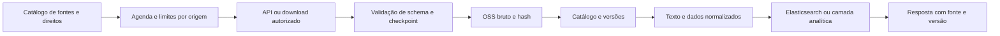

# RagMed — catálogo de APIs públicas e conectores

Data de verificação: 13/09/2026. Complementa [portais, datasets e fluxos](RAGMED-PORTAIS-DATASETS-FLUXOS.md).

O catálogo distingue API documentada, serviço de coleta e portal de download. Resposta HTTP 200 confirma somente uma consulta pontual; não comprova SLA, completude, licença de redistribuição ou homologação de um conector. Nenhuma ingestão em produção foi executada.

## 1. APIs e serviços com consulta pontual bem-sucedida

| Fonte | Endpoint/base e exemplo | Autenticação e limites | Uso no RagMed |
|---|---|---|---|
| IBGE Localidades | `https://servicodados.ibge.gov.br/api/v1/localidades/municipios/2303709` | Consulta pública sem chave no teste; quota não confirmada | Código e contexto territorial de Caucaia; normalização geográfica |
| NCBI / PubMed E-utilities | `https://eutils.ncbi.nlm.nih.gov/entrez/eutils/esearch.fcgi?db=pubmed&term=diabetes&retmax=1&retmode=json` | Limite documentado: 3 requisições/s sem chave; 10/s por chave padrão. Controlar globalmente por IP/chave | Descoberta bibliográfica; esummary/efetch para metadados permitidos |
| Europe PMC | `https://www.ebi.ac.uk/europepmc/webservices/rest/search?query=diabetes&format=json&pageSize=1` | Busca pública sem chave no teste; limite não homologado | Descoberta de estudos e vínculos para texto integral disponível |
| PMC OAI-PMH | `https://pmc.ncbi.nlm.nih.gov/api/oai/v1/mh/?verb=Identify` | Identify respondeu sem chave; respeitar documentação e política de coleta | Coleta estruturada dos conjuntos permitidos e atualizações |
| Crossref | `https://api.crossref.org/works?rows=1` | Consulta pública; identificação de contato e pool adequado recomendados; respeitar headers de limites | DOI, metadados e relações editoriais disponíveis |
| ClinicalTrials.gov API v2 | `https://clinicaltrials.gov/api/v2/studies?pageSize=1&format=json` | Leitura sem chave no teste; aplicar política oficial e backoff | Ensaios registrados, status e resultados quando publicados |

Os seis endpoints acima retornaram HTTP 200. As respostas JSON/XML foram amostradas, sem download integral de corpus nem validação semântica completa. A consulta a um ensaio não significa que há resultado ou eficácia demonstrada. Um PMID ou DOI não autoriza baixar o PDF do editor.

Documentação: [IBGE](https://servicodados.ibge.gov.br/api/docs), [NCBI E-utilities e limites](https://www.ncbi.nlm.nih.gov/books/NBK25497/?report=reader), [Europe PMC](https://europepmc.org/RestfulWebService), [PMC OAI](https://pmc.ncbi.nlm.nih.gov/tools/oai/), [Crossref acesso](https://www.crossref.org/documentation/retrieve-metadata/rest-api/access-and-authentication/), [ClinicalTrials.gov](https://clinicaltrials.gov/data-about-studies/learn-about-api).

A página Europe PMC teve bloqueio na consulta via navegador de pesquisa, mas o endpoint EBI respondeu no teste direto. São superfícies distintas. Crossref anunciou ajustes por tipo de requisição em julho/2026; ler `x-rate-limit-limit`, `x-rate-limit-interval`, `x-rate-limit-type` e concorrência em vez de fixar uma quota universal. [Atualização Crossref](https://community.crossref.org/t/refining-rest-api-limits-for-improved-stability-and-reliability/16137).

## 2. Fontes brasileiras e situação dos conectores

| Fonte | Interface pública identificada | Situação e próximo passo |
|---|---|---|
| Dados Abertos do SUS | [Portal](https://dadosabertos.saude.gov.br/) aponta para [API Dados Abertos](https://apidadosabertos.saude.gov.br/) | Documentação vinculada oficialmente; autenticação, rotas e quotas precisam de homologação |
| Catálogo CKAN SUS | Candidato técnico: `https://ckan-dadosabertos.saude.gov.br/api/3/action/package_search?rows=1` | Tentativa direta falhou na resolução DNS neste ambiente. Não classificar como conector funcional nem confundir com a API oficial acima |
| IBGE Agregados | `https://servicodados.ibge.gov.br/api/v3/agregados` | API documentada; descobrir agregado, variáveis, períodos e localidades; não inventar ID de tabela PNS |
| IBGE PNS | [Microdados](https://ftp.ibge.gov.br/PNS/2019/Microdados/Dados/) | Download oficial, não API de prontuários; ingerir dicionários, pesos e desenho amostral |
| DATASUS SIH/SIM/SINASC/CNES | [Transferência de arquivos](https://datasus.saude.gov.br/transferencia-de-arquivos/) | Conector de arquivos/competências; validar layout, formato e revisões por base |
| Anvisa Bulário | [Portal oficial](https://www.gov.br/anvisa/pt-br/sistemas/bulario-eletronico) | Nenhuma API pública estável de bulas foi homologada neste catálogo; validar acesso permitido e versão por apresentação |
| Conitec PCDT | [Índice oficial](https://www.gov.br/conitec/pt-br/protocolos-clinicos-e-diretrizes-terapeuticas) | Conector documental para índice e publicações; não apresentar como API REST |
| SciELO | [Coleção e política de acesso](https://www.scielo.org/pt-br/sobre-o-scielo/declaracao-de-acesso-aberto/) | Priorizar canais estruturados autorizados; confirmar endpoint/coleção e licença por artigo antes da coleta |
| BVS/LILACS e DeCS | [BVS](https://bvsalud.org/) | Candidatos complementares; endpoint, licença terminológica e limites ainda não verificados |

O acervo público não oferece uma API universal de prontuários brasileiros. RNDS, integrações institucionais e dados individuais exigem contexto de acesso próprio; não integrar como se fossem bases abertas.

## 3. Contrato de cada conector

```yaml
source_id: pubmed
interface: eutilities
base_url: https://eutils.ncbi.nlm.nih.gov/entrez/eutils/
status: smoke-tested
owner: ragmed-data-team
auth: optional-api-key
rate_policy: shared-per-ip-or-key
checkpoint: source-specific-cursor
retry:
  backoff: exponential-with-jitter
  respect_retry_after: true
  max_attempts: 5
rights:
  metadata: review-source-terms
  fulltext: per-document
  training: separate-review
output:
  raw: private-oss
  manifest: versioned
  catalog: postgresql
```

O estado `smoke-tested` não equivale a `production-approved`. Segredos ficam em cofre; não registrar chaves em URLs de logs. Cursor, data e política de atualização são específicos de cada fonte. Separar chave de deduplicação bibliográfica de versão de conteúdo.

## 4. Fluxo de integração



Ordem proposta: IBGE + PubMed/Crossref para metadados; PMC/Europe PMC para texto autorizado; ClinicalTrials para ensaios; PCDT/SciELO/Bulário em conectores próprios; SUS/DATASUS para dados estruturados. Não transformar tabelas populacionais em respostas clínicas individuais.

Antes da produção, testar paginação completa, recomeço após falha, limites compartilhados, alteração de schema, duplicatas, correções/retrações, exclusão, licença e restauração. Manter um documento de referência por conector com proveniência reproduzível até o trecho retornado pela busca.

## 5. APIs oferecidas pelo RagMed

São endpoints propostos, ainda não implantados, diferentes das APIs públicas das fontes:

- `POST /v1/evidence/search`: recuperação com filtros autorizados.
- `POST /v1/evidence/answer`: resposta com suporte por afirmação.
- `GET /v1/documents/{id}/versions`: histórico documental.
- `GET /v1/answers/{id}/provenance`: trilha da resposta, respeitando autorização.
- `POST /v1/clinical/timeline`: síntese privada, sujeita à política institucional.

Definir autenticação, escopos, quotas, idempotência, retenção e contrato OpenAPI antes da implementação. O tenant é derivado da identidade autenticada; nunca confiar apenas no identificador enviado pelo cliente.
