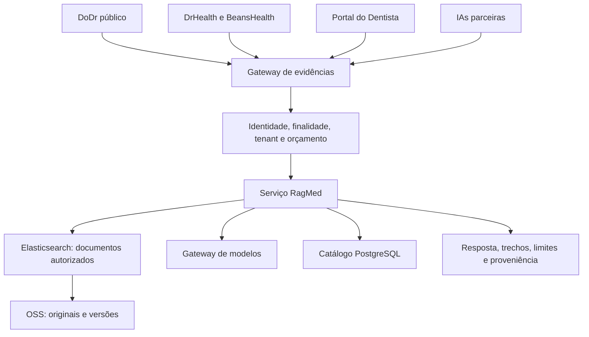
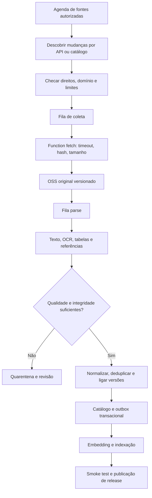
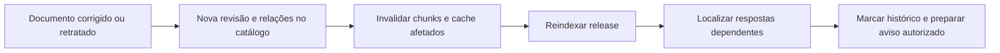
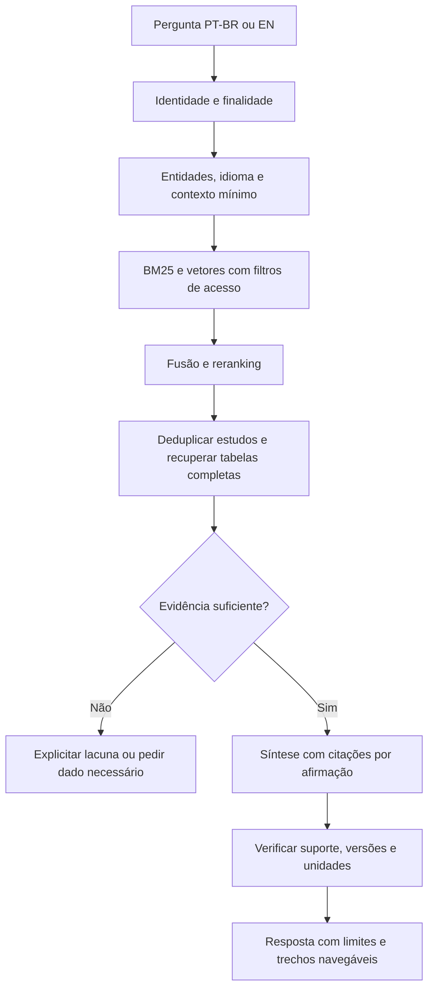
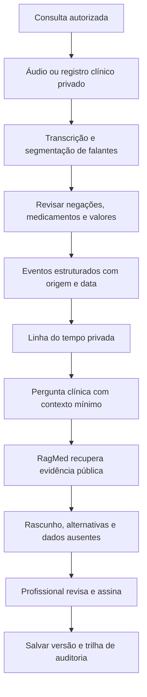
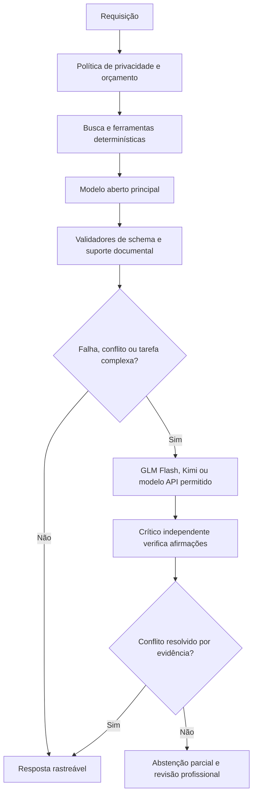
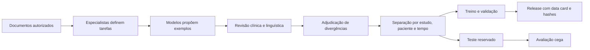

# DoDr + RagMed — portal, dados brasileiros e inteligência médica verificável

Versão 1.0 • Pesquisa em 13/09/2026 • PT-BR e inglês.

Complementos: [catálogo de APIs públicas](RAGMED-APIS-PUBLICAS.md) e [estudo BeansTech — datacenter de R$ 150 milhões / R$ 300 milhões acumulados](estudo-datacenter-beanstech/ESTUDO-INVESTIMENTO.md).

Este documento complementa [projeto.md](../projeto.md). É uma proposta de implementação: pastas existentes foram inspecionadas, fontes públicas consultadas e domínios pesquisados por RDAP. Não foram implantados serviços, baixados datasets clínicos ou registrados domínios. Capacidades propostas dos modelos precisam de avaliação própria; presença de uma pasta não comprova serviço ativo.

## 1. Produto e marca

**Recomendação: DoDr como marca de experiência e RagMed como infraestrutura de evidências.** Aproveitar `dodr.ai`, informado como já pertencente ao grupo. Posicionamento: **“DoDr — Medicina com evidência.”** Para inglês: “Medicine, grounded in evidence.”

O diferencial mundial proposto é uma evidência navegável: o médico chega à afirmação, abre o trecho original, compara versões, identifica a população do estudo e entende onde o conhecimento termina. A mesma evidência é acessível por API às outras IAs.

“Maior portal” deve ser uma ambição acompanhada por métricas públicas: documentos únicos autorizados, especialidades cobertas, proporção atualizada, uso profissional e desempenho independente. Contar PDFs duplicados ou respostas geradas não demonstra liderança.

### Nomes e domínios

| Opção | Avaliação editorial | Resultado observado em 13/09/2026 |
|---|---|---|
| **DoDr / dodr.ai** | Melhor continuidade; curto, já é ativo da marca segundo o usuário | Titularidade informada pelo usuário; não auditada |
| **dodr.com.br** | Minha primeira opção complementar para o público brasileiro | RDAP Registro.br retornou HTTP 404 |
| **Clinovara / clinovara.com.br** | Alternativa inventada, sonora, relacionada à clínica | RDAP Registro.br retornou HTTP 404 |
| **Medveria / medveria.com.br** | Alternativa inventada, associação a medicina e verificação | RDAP Registro.br retornou HTTP 404 |
| Evidora / evidora.com.br | Associação forte a evidência | RDAP retornou HTTP 200; registro encontrado |

Consulta utilizada: `https://rdap.registro.br/domain/<dominio>`. HTTP 404 significa que a consulta não encontrou objeto naquele momento; disponibilidade de registro, reserva e preço devem ser confirmados no [Registro.br](https://registro.br/). Nenhuma pesquisa conclusiva de marca foi realizada: consultar nomes e semelhantes no [INPI](https://www.gov.br/inpi/pt-br/servicos/marcas). Não há base para prometer nome “não registrado”.

Minha escolha de TLD para aquisição nacional é `.com.br`; para a marca tecnológica já existente, `.ai`. Usar um domínio canônico por idioma/conteúdo e redirecionar os demais. `.com` pode servir à expansão internacional, sujeito a aquisição; não foi consultado. O TLD sozinho não assegura melhor posicionamento em buscas.

### Superfícies propostas sob o domínio existente

| Endereço proposto | Produto |
|---|---|
| `dodr.ai` | Portal público e páginas editoriais |
| `dodr.ai/br` e `dodr.ai/en` | Conteúdo localizado com equivalência e hreflang |
| `app.dodr.ai` | Área profissional e consulta assistida |
| `evidence.dodr.ai` | Biblioteca e comparação de evidências |
| `api.dodr.ai` | API RagMed autenticada |
| `developers.dodr.ai` | SDKs, contratos e exemplos sintéticos |
| `status.dodr.ai` | Estado dos serviços |

Os subdomínios são propostas, não registros DNS criados. O nome ragmed.ai não pressupõe posse do domínio. Separar o domínio médico do eventual RagJur jurídico em permissões, índices e rotas.

## 2. Integração com os projetos encontrados

A pasta real é `healthtech`, no singular.

| Pasta existente | Integração proposta |
|---|---|
| `drhealth-web`, `drhealth-api` | Interface profissional e backend intermediário para consulta à evidência |
| `beanshealth`, `beanshealth-prototype`, `beansmed`, `beansm` | Avaliar qual produto é canônico; reaproveitar componentes sem duplicar prontuários |
| `portal-dentista` | Coleção odontológica, busca por procedimento e revisão profissional; README identifica portaldodentista.ai |
| `whisper-medical-ptbr` | Integração de transcrição, se o serviço atender às avaliações de português clínico |
| `bankhealth-web`, `bankhealth-api`, `healthbank` | Consumo específico de informação administrativa; acesso clínico somente quando necessário e autorizado |
| `pesquisas-ia` | Experimentos e avaliações reproduzíveis |

Confirmar contratos, autenticação e backend de cada aplicação antes de integrar. A inspeção atual não determina qual variante está em produção.



## 3. Biblioteca brasileira: o que coletar e para quê

Existem quatro produtos de dados diferentes: documentos para RAG; tabelas para consultas estatísticas; datasets para treinamento; benchmarks reservados. Ter acesso público não implica poder redistribuir, treinar comercialmente ou tratar dados como anônimos. Cada recurso entra com direitos próprios.

| Fonte brasileira | Conteúdo e uso | Aquisição e regra de entrada |
|---|---|---|
| [Conitec / PCDT](https://www.gov.br/conitec/pt-br/protocolos-clinicos-e-diretrizes-terapeuticas) | Protocolos e diretrizes; prioridade para RAG aplicado ao SUS | Catalogar documento, portaria e vigência; revisar licença de cada publicação antes de espelhar |
| [Bulário Anvisa](https://www.gov.br/anvisa/pt-br/sistemas/bulario-eletronico) | Bulas profissionais e do paciente | Separar apresentação, fabricante, registro e versão; não tratar uma bula antiga como vigente; validar acesso automatizado e direitos |
| [SciELO](https://www.scielo.org/pt-br/sobre-o-scielo/declaracao-de-acesso-aberto/) | Artigos científicos brasileiros PT/EN | Preferir XML quando autorizado; manter licença por artigo e estado editorial; acesso aberto não uniformiza todas as licenças |
| [Dados Abertos do SUS](https://dadosabertos.saude.gov.br/) | Catálogo de vigilância, assistência e outras bases públicas | Ler metadados e dicionário por recurso; usar API/download disponibilizado; controlar revisões |
| [SIVEP-Gripe, via catálogo SUS](https://dadosabertos.saude.gov.br/) | Vigilância de síndromes respiratórias | Camada analítica; registrar data da extração e revisões; não converter notificações em recomendações individuais |
| [DATASUS: SIH/SUS](https://datasus.saude.gov.br/transferencia-de-arquivos/) | Internações e produção hospitalar | Parquet e consultas agregadas; observar natureza administrativa dos registros |
| [DATASUS: SIM e SINASC](https://datasus.saude.gov.br/transferencia-de-arquivos/) | Mortalidade e nascidos vivos | Indicadores populacionais; avaliar risco de identificação em recortes pequenos |
| [DATASUS: CNES](https://datasus.saude.gov.br/transferencia-de-arquivos/) | Cadastro de estabelecimentos | Diretório assistencial com competência/data; cadastro não confirma agenda ou capacidade em tempo real |
| [PNS / IBGE](https://www.ibge.gov.br/estatisticas/sociais/saude/9160-pesquisa-nacional-de-saude.html?edicao=30563) | Inquérito populacional e saúde bucal | Microdados e dicionários oficiais; incorporar pesos e desenho amostral; não usar média simples indevidamente |
| [PAD-UFES-20](https://github.com/labcin-ufes/PAD-UFES-20) | Imagens clínicas de lesões de pele com metadados | Usar repositório original para chegar aos arquivos e licença; separar pacientes entre treino/teste; projeto multimodal de pesquisa |
| [BRAX / PhysioNet](https://physionet.org/content/brax/1.0.0/) | Radiografias torácicas brasileiras rotuladas | Respeitar credenciamento e acordo indicado pela versão; não espelhar como download público irrestrito |
| [SemClinBr — publicação](https://arxiv.org/abs/2001.10071) | Anotações semânticas em textos clínicos brasileiros | Candidato para extração de entidades; acesso e uso sujeitos às condições do detentor |
| [LABDAPS/texto-clinico-brasileiro](https://huggingface.co/datasets/LABDAPS/texto-clinico-brasileiro) | Agregação de corpora em português clínico | Mapear cada corpus de origem; licença do agregador não substitui permissões de cada componente |
| [DrBodeBench](https://huggingface.co/datasets/recogna-nlp/drbodebench) | Avaliação em questões médicas brasileiras | Reservar para avaliação; verificar licença e possível exposição prévia nos modelos; não ingerir no RAG avaliado |

**Primeira coleção:** PCDT + documentos Anvisa autorizados + artigos SciELO com licença compatível. Em paralelo, PNS/CNES/SIH para contexto epidemiológico e diretório. BRAX e PAD-UFES ficam em trilhas de pesquisa separadas, sem apresentação automática de diagnóstico ao público.

O repositório pode publicar metadados e instruções de acesso onde não puder redistribuir os dados. Não republicar prontuários identificáveis. Índices vetoriais e derivados também precisam de política de acesso e exclusão.

Para inglês, conectar [Europe PMC](https://europepmc.org/RestfulWebService), [PMC pelos serviços permitidos](https://pmc.ncbi.nlm.nih.gov/tools/oai/) e [ClinicalTrials.gov](https://clinicaltrials.gov/data-about-studies/learn-about-api). Metadados de ensaios descrevem registros e resultados disponíveis; registro isolado não comprova eficácia.

## 4. Organização do repositório e do OSS

Estrutura-alvo, ainda não criada:

```text
healthtech/ragmed/
  apps/portal/                 # experiência DoDr
  services/gateway/            # identidade, finalidade e limites
  services/retrieval/          # busca e evidências
  services/clinical-context/   # linha do tempo privada
  services/model-router/      # políticas e adapters
  functions/discover/
  functions/fetch/
  functions/parse/
  functions/validate/
  functions/publish/
  functions/retract/
  connectors/{conitec,anvisa,scielo,datasus,ibge,pmc}/
  schemas/{source,document,claim,event,dataset,answer}/
  registry/{sources,models,licenses}/
  evals/{retrieval,clinical,ptbr,en,security,regression}/
  infrastructure/{oss,fc,queue,ecs,elastic}/
  docs/{architecture,data-cards,runbooks}/
```

Buckets privados separados para originais públicos autorizados, material clínico por instituição, derivados e exportações. Nomes reais devem respeitar disponibilidade e convenções da conta.

```text
raw/<source>/<document-id>/<sha256>/original.pdf
curated/<source>/<document-id>/<revision>/document.json
curated/<source>/<document-id>/<revision>/tables.parquet
artifacts/<pipeline-version>/<document-id>/<revision>/chunks.jsonl
manifests/<collection>/<release>/manifest.json
clinical/<tenant>/<patient-pseudonym>/<event-id>/<revision>.json
quarantine/<reason>/<job-id>/report.json
```

Guardar metadados transacionais no PostgreSQL; OSS guarda objetos e manifestos; Elasticsearch guarda projeções reconstruíveis. Não usar nomes ou CPF nas chaves de objetos. Habilitar versionamento, criptografia, permissões mínimas e logs adequados; testar restauração. Retenção imutável deve ser compatível com direitos de exclusão e finalidade do acervo.

### Contrato mínimo de documento

```yaml
document_id: "source:stable-id"
revision: "content-sha256"
source_url: "https://fonte-oficial/documento"
retrieved_at: "timestamp-UTC"
published_at: null
valid_from: null
valid_to: null
language: pt-BR
jurisdiction: BR
license_id: pending-review
rights:
  store_fulltext: false
  serve_fulltext: false
  use_for_training: false
  derive_embeddings: false
editorial_status: unreviewed
supersedes: null
access_scope: public-approved
parser_version: pinned-version
source_sha256: "sha256"
```

Campos false representam padrão de bloqueio até classificação da fonte. Acrescentar DOI/PMID/registro Anvisa quando existir, autores, especialidade, população, desenho do estudo, evidências por página e histórico de correções. Não atribuir grau GRADE automaticamente apenas pelo tipo de estudo.

## 5. Fluxo de ingestão automatizável



Functions recebem IDs e URIs, não PDFs inteiros nas mensagens. Separar funções pequenas por etapa; OCR pesado e inferência rodam em workers adequados. Limitar concorrência por fonte; backoff com jitter, dead-letter queue e reprocessamento idempotente por hash + versão da etapa. Não presumir entrega única dos eventos. Destinos de saída diferentes evitam loops de trigger OSS.

Preferir APIs e dumps oficiais. Scraper HTML somente quando compatível com termos e limites da origem. Proteger fetch contra SSRF, redirecionamentos a redes privadas, arquivos enormes e conteúdo malicioso. Texto coletado é dado, nunca autorização para executar ferramentas.

### Atualizações e retrações



Não apagar silenciosamente a história científica. Busca padrão favorece versão vigente; modo histórico mostra explicitamente data e situação. Avisos externos dependem da assinatura do usuário e das permissões do produto.

## 6. Elasticsearch como RAG documental e analítico

Sim: Elasticsearch pode ser o mecanismo central para artigos, estudos, bulas e protocolos. Deve combinar busca lexical, vetorial e filtros anteriores à recuperação; depois aplicar reranking e verificação dos trechos. O documento original continua no OSS.

Índices propostos: `evidence-documents-v1`, `evidence-chunks-v1`, `drug-labels-v1`, `clinical-events-v1` com isolamento apropriado, `terminology-v1`. Separar índices clínicos dos públicos e manter autorização também no backend. Consultas estatísticas de microdados devem passar por serviços SQL/analíticos governados, com agregação e supressão de células pequenas, sem transformar todas as linhas em embeddings.

Para produção institucional, prefiro Elastic gerenciado quando região, contrato, orçamento e conectividade atenderem ao projeto. ECS pode servir ao piloto e também à produção com equipe operacional, redundância, snapshots testados e monitoramento. Escolher versão estável suportada após homologação; não usar tag `latest` nem atualizar automaticamente a produção. A comparação detalhada de infraestrutura está no projeto principal.



Usar BGE-M3 já listado como baseline e comparar alternativas por recall PT→EN, EN→PT, siglas e nomes comerciais brasileiros. Escolher reranker pelo benchmark local. Fixar modelo de embedding por índice; trocar embedding exige reconstrução e avaliação. Similaridade vetorial não é confiança clínica.

## 7. Fluxo de consulta e síntese longitudinal



Cada evento mantém data de ocorrência, data de registro, fonte e estado: suspeita, confirmação, negação ou resolução. Distinguir medicamento prescrito de medicamento efetivamente usado. Conflitos permanecem visíveis. pyannote identifica segmentos de falantes; o vínculo “médico/paciente” precisa de confirmação.

A síntese é uma projeção recalculável. Não substituir o prontuário original por um resumo. Elasticsearch pode recuperar eventos, enquanto o sistema clínico e o catálogo mantêm a verdade transacional. Nenhum evento individual entra na biblioteca pública ou no treinamento por padrão.

## 8. Modelos juntos: responsabilidades e abertura

Os nomes foram conferidos em fontes oficiais quando identificáveis. “Pesos abertos” não garante dados de treinamento disponíveis nem reprodução integral do treinamento. Um modelo geral excelente ainda precisa de validação clínica PT-BR.

| Família ou modelo | Evidência de abertura | Papel proposto, sujeito a avaliação |
|---|---|---|
| **Qwen/Qwen3.8-27B** | Pesos publicados, Apache-2.0 na model card | Candidato inicial a extração, ferramentas, leitura documental e síntese RAG hospedada pelo grupo |
| **Qwen3.8 de classe Max** | Repositório oficial apresenta Qwen3.8-2.4T-A95B; verificar licença do checkpoint | Pesquisas difíceis sob demanda; não equiparar automaticamente alias comercial Max ao checkpoint aberto |
| **zai-org/GLM-5.3-Flash** | Pesos publicados, MIT | Candidato a executor de pesquisas e revisor de síntese; comparar ganho e custo com 27B |
| **Kimi K3** | Pesos publicados sob Kimi K3 License própria | Revisão de grandes conjuntos documentais e pesquisa complexa; revisar termos antes de hospedagem/derivação |
| **GPT-6 Astra** | Identificador documentado pela OpenAI; tratar como API proprietária neste projeto | Revisor opcional de casos difíceis, ferramentas e avaliações |
| **Claude** | Selecionar identificador exato da API e contrato; não assumir pesos abertos | Crítica independente de redação e cobertura de evidências |
| **Grok** | Separar modelo atual de API de releases históricos com pesos disponíveis | Descoberta de temas e revisão experimental; confirmar alegações em fontes primárias |

Fontes: [Qwen3.8 oficial](https://github.com/QwenLM/Qwen3.8), [Qwen3.8-27B e licença](https://huggingface.co/Qwen/Qwen3.8-27B), [ModelScope correspondente](https://www.modelscope.cn/models/Qwen/Qwen3.8-27B), [GLM-5.3-Flash](https://huggingface.co/zai-org/GLM-5.3-Flash), [Kimi K3](https://github.com/MoonshotAI/Kimi-K3), [GPT-6 Astra](https://developers.openai.com/api/docs/models/gpt-6-astra), [Claude](https://www.anthropic.com/claude), [abertura histórica do Grok](https://x.ai/news/grok-os). O ModelScope depende de renderização e não forneceu texto de licença na consulta; a licença do Qwen foi conferida no Hugging Face.

**GLM Flash merece um piloto, mas não há evidência aqui de superioridade clínica.** A model card informa 320 bilhões de parâmetros totais e 18 bilhões ativos. Estimativa aritmética para pesos a 4 bits: aproximadamente 160 GB, antes de escalas, cache e runtime. Parâmetros ativos menores reduzem computação, mas não eliminam armazenamento dos demais pesos. Não planejar residência integral em 24 GB ou 72 GB. Offload exige medir latência e throughput reais.

Para 27B, a mesma conta dá cerca de 13,5 GB apenas em pesos a 4 bits. Contexto, concorrência, multimodalidade e runtime elevam consumo. Essas contas não são dimensionamento de implantação. Grandes Kimi/Qwen não devem ser carregados permanentemente sem justificar custo com tráfego e desempenho.

### Como reaproveitar os modelos já listados pelo grupo

| Grupo | Uso inicial proposto |
|---|---|
| Granite geral | Extração e tarefas administrativas; competir com Qwen pelo mesmo conjunto de avaliação |
| Granite Guardian 8B / Prompt Guard | Sinais de abuso e injeção; calibrar em português; não certificar correção médica |
| MedGemma / Palmyra / outros médicos | Candidatos a síntese especializada com RAG; revisar licenças e medir por especialidade |
| Whisper / pyannote | Transcrição e segmentação; avaliar erro em nomes, doses e negações |
| Qwen-VL | OCR e entendimento de páginas, com validação de tabelas |
| BGE-M3 | Recuperação bilíngue de base |
| PII detector | Auxiliar detecção de dados pessoais, combinado com regras e revisão; não garante anonimização |
| CheXagent, GigaPath, MedSigLIP, Lingshu | Pesquisa multimodal específica; integração depende de modalidade, licença e validação |
| FinBERT / DNABERT | Trilhas financeiras/genômicas próprias, fora do núcleo de busca médica geral |

Disponibilidade operacional desses modelos na conta não foi auditada nesta entrega.

## 9. Orquestração com custo e qualidade controlados



Não chamar seis modelos para cada pergunta. Começar com um executor e ferramentas; adicionar um crítico apenas onde houver benefício medido. Concordância entre modelos não substitui evidência, e pode refletir erros compartilhados. Julgar cada afirmação pelo trecho de suporte e aplicabilidade, preservando discordância relevante.

O roteador deve usar sinais observáveis: fontes faltantes, conflitos, saída inválida, complexidade e orçamento. Não confiar apenas na autodeclaração de confiança do modelo. Registrar decisão de roteamento, modelo/checkpoint, parâmetros, fontes e resultado; não exigir armazenamento de raciocínio interno.

Política proposta: requisições públicas sem dados pessoais podem usar provedores aprovados; casos clínicos seguem isolamento, finalidade e contrato específicos. Remover identificadores não torna automaticamente um caso anônimo. Se o provedor externo não estiver aprovado para aquela classe de dados, manter processamento interno ou recusar a etapa externa.

### Contrato de resposta às IAs parceiras

```json
{
  "answer_id": "uuid",
  "status": "supported|partial|insufficient",
  "language": "pt-BR",
  "claims": [{
    "text": "Afirmação gerada",
    "evidence": [{"document_id": "id", "revision": "sha256", "chunk_id": "id", "page": 1}],
    "applicability": "População e contexto",
    "limitations": []
  }],
  "missing_information": [],
  "corpus_release": "release-id",
  "model_revision": "pinned-id"
}
```

Esse JSON é ilustrativo; `status` deve assumir um único valor enumerado na implementação. Endpoints propostos: `POST /v1/evidence/search`, `POST /v1/evidence/answer`, `GET /v1/documents/{id}/versions`, `POST /v1/clinical/timeline`, `GET /v1/answers/{id}/provenance`. Identidade do tenant vem do token validado, nunca de um campo livre confiado ao cliente.

## 10. Dataset PT-BR de excelência

Construir **DoDr Evidence-BR**, nome de trabalho sem validação de marca. Cada exemplo deve conter pergunta realista, evidência original licenciada, resposta de referência, critérios de correção, limites e proveniência. Produzir versão inglesa com revisão bilíngue e mesmo significado clínico.



A proposta sintética de um LLM é material candidato. Só entra no conjunto de referência após revisão. Conferir também termos do fornecedor antes de usar saídas para treinamento de outros modelos.

Piloto proposto de **2.000 casos revisados**, dimensionamento editorial inicial: 500 busca/citação, 400 interpretação de diretrizes, 300 medicamentos, 300 síntese longitudinal sintética, 200 tabelas/epidemiologia, 200 abstenção/conflitos e 100 odontologia. Separação inicial 60/20/20 por grupos de origem, com teste temporal adicional quando houver acervo suficiente. Traduzir um caso não cria um exemplo independente para outro split.

Incluir regionalismos, siglas ambíguas, erros de digitação, gestação, pediatria, idosos, negações e diferenças SUS/saúde suplementar. A distribuição deve refletir as tarefas do piloto; subgrupos raros precisam de amostra adicional. Exames públicos podem ter contaminação prévia, por isso DrBodeBench é complemento ao teste novo reservado.

O conjunto público distribui somente exemplos com direitos adequados e dados sintéticos ou autorizados. Manter gabarito de avaliação reservado e separado dos índices RAG e do treinamento. Registrar revisores, desacordo e adjudicação, sem expor dados pessoais desnecessários.

## 11. Avaliação e critérios de liberação

| Dimensão | Medida proposta |
|---|---|
| Recuperação | Recall@k, nDCG e recuperação bilíngue por especialidade |
| Fundamentação | Fração de afirmações realmente sustentadas; citação correta de versão e página |
| Clínica | Erros com impacto clínico, gravidade e omissões adjudicados por profissionais |
| Abstenção | Resposta indevida sem evidência e recusa indevida quando há suporte |
| Longitudinal | Datas, negações, mudanças de dose e distinção entre hipótese/confirmação |
| Privacidade | Acesso entre tenants, vazamento em logs/cache e reidentificação por contexto |
| Operação | Latência p50/p95, disponibilidade, custo por resposta aprovada e backlog |
| Editorial | Atualidade, atraso de correções e cobertura de direitos/proveniência |

Comparar baseline de busca, modelo principal e principal + crítico em casos idênticos, com revisão cega e intervalos de confiança. Definir limites numéricos com responsáveis clínicos antes do piloto. Falhas críticas de isolamento ou erros clínicos graves não resolvidos bloqueiam promoção. Não anunciar qualidade institucional com base apenas em métricas automáticas de similaridade.

O modelo vence por qualidade por custo no fluxo real. Medir economia de tempo de revisão profissional e alterações que o profissional precisou fazer. A avaliação clínica e regulatória deve corresponder ao uso pretendido; este documento não representa homologação para diagnóstico ou prescrição autônoma.

## 12. Plano de execução

| Etapa | Entregável | Condição de conclusão |
|---|---|---|
| 1 — Inventário | Aplicações canônicas, recursos da conta, responsáveis e fontes autorizadas | Configuração real e custos conhecidos |
| 2 — Fundação | Catálogo, OSS, filas, schemas e permissões | Ingestão idempotente e restauração demonstradas |
| 3 — Coleção inicial | PCDT/SciELO e bulas autorizadas | Fonte até trecho reproduzível e versões navegáveis |
| 4 — Busca | Elastic híbrido e API autenticada | Avaliação PT/EN e testes de acesso aprovados |
| 5 — Portal | DoDr e piloto odontológico | Respostas com fontes, limites e revisão editorial |
| 6 — Modelos | Qwen/Granite baseline e GLM Flash candidato | Benchmark cego e custo observados |
| 7 — Consulta | Linha do tempo e transcrição em ambiente privado | Avaliação clínica e operacional aprovada |
| 8 — Ecossistema | SDK/API de evidências e parceria institucional | Contratos, quotas, auditoria e operação definidos |

Não iniciar todas as frentes simultaneamente. O primeiro corte demonstrável é: pergunta em português → protocolo autorizado → trecho original → resposta citada → versão auditável. Depois adicionar inglês, dados estruturados e consulta privada.

### Demonstração para Einstein, Fleury, Rede D’Or e Dasa

Propor a cada instituição uma tarefa definida por ela e avaliação com revisores independentes. Mostrar uma pergunta difícil, uma atualização de diretriz, um caso em que o sistema se abstém e uma correção rastreada até respostas anteriores. Entregar relatório de erros, custo e tempo economizado. Não presumir parceria, endosso ou disponibilidade de dados dessas instituições.

O ativo estratégico será o acervo autorizado e atualizado, o benchmark clínico brasileiro, a proveniência e a integração no trabalho médico. Modelos podem ser substituídos sem reconstruir esse patrimônio.
