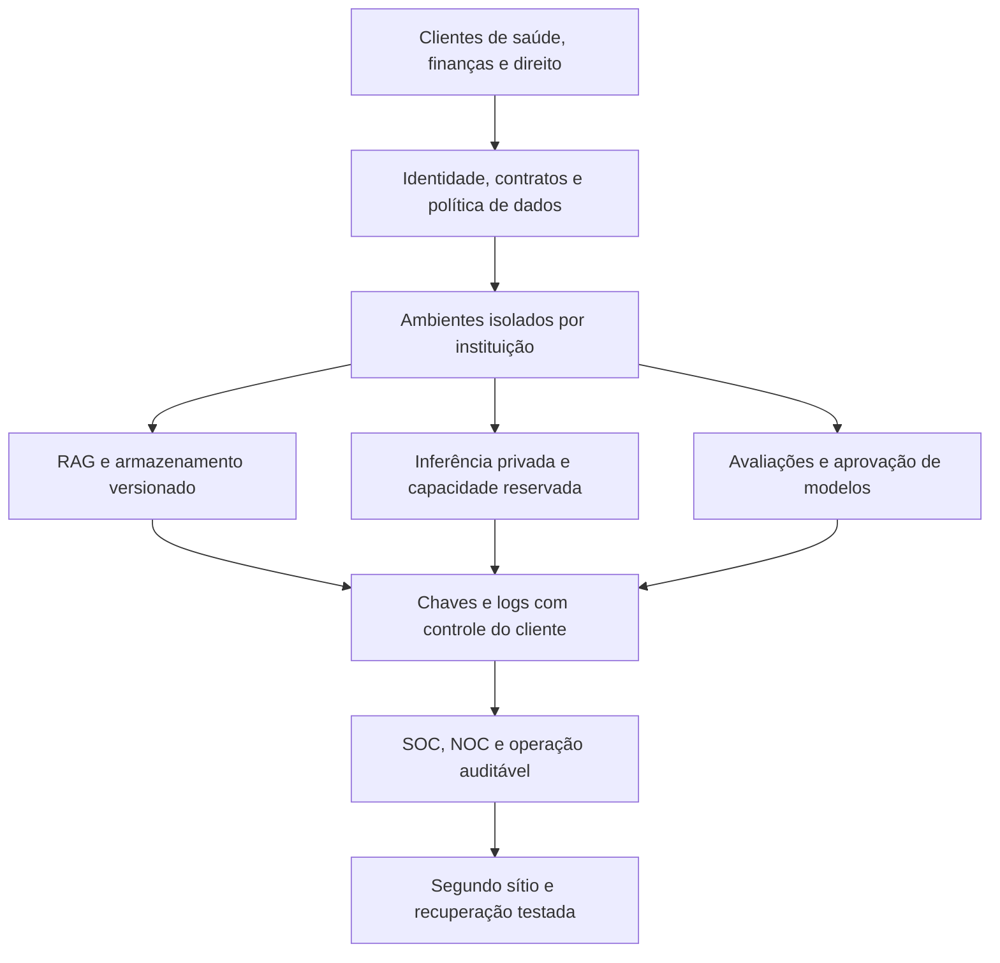
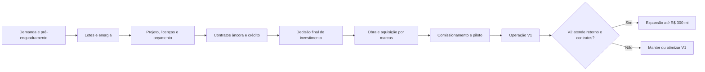

# BeansTech — estudo de investimento em datacenter de IA no Pecém

> Decisão complementar: [localização, precedentes TJSP e proposta Z.Cloud/GLM.Cloud](LOCALIZACAO-TJSP-PARCERIA-GLM.md), com análise do programa Z.ai Sovereign Partner Program.

> Atualização de escopo: [venda de produtos, APIs e nuvem ao mercado brasileiro](ZPE-MERCADO-BRASILEIRO-APIS-NUVEM.md). Distingue mercadorias industrializadas de serviços digitais e registra o encerramento da MP 1.307/2025.

## 1. Parecer executivo

**Recomendação: avançar com desenvolvimento e validação comercial, sem comprometer imediatamente R$ 150 milhões em uma construção integral dentro da ZPE.** O orçamento definido é R$ 150 milhões na V1 e R$ 300 milhões acumulados na V2, portanto R$ 150 milhões adicionais na expansão. O empreendimento deve ser estruturado como infraestrutura de IA para setores regulados, com receita contratada, isolamento de dados e serviços especializados.

A alternativa preferencial para a demanda brasileira é comparar instalação **fora do perímetro aduaneiro da ZPE, no eixo Caucaia–Pecém**, com colocation de alta densidade. Uma unidade dentro da ZPE merece estudo específico quando houver contratos de exportação. O endereço mais incentivado não é necessariamente o melhor endereço para o produto.

Há quatro conclusões que alteram a decisão:

1. O art. 21-C da Lei 11.508/2007 exige, para a pessoa jurídica exclusivamente prestadora de serviços nesse enquadramento, projeto de exportação e ausência de receita de serviços no mercado interno. Atender diretamente hospitais, bancos e escritórios brasileiros exige examinar outro enquadramento ou outra estrutura operacional. [^1]
2. Em **13/09/2026**, o PL 278/2026, REDATA, aparece como remetido à sanção em 04/09, com prazo até 25/09. Sua economia não está incorporada como benefício adquirido. [^2]
3. O Ceará possui a Lei 19.849/2026 para datacenters e armazenamento de energia, mas a destinação de áreas públicas do art. 9º refere-se a **SAEB**. Não equivale a doação automática de terreno para datacenter. [^3]
4. MPF e DPU anunciaram em 10/09/2026 ação sobre consulta indígena e estudos ambientais do Data Center Pecém. Trata-se de demanda judicial anunciada, não de comprovação de ordem de paralisação. A situação do terreno BeansTech precisa de análise própria. [^4]

O modelo ilustrativo sem incentivos aprovados apresenta VPL a 15% de **−R$ 100,1 milhões na V1** e **−R$ 117,6 milhões na trajetória até a V2**, no cenário de referência. No favorável, os resultados são **+R$ 9,0 milhões** e **+R$ 71,3 milhões**. Isso demonstra sensibilidade comercial, não uma avaliação de mercado da BeansTech. Preço, ocupação, contratos e custos ainda não foram cotados.

A proposta de investimento deve ser condicionada a clientes âncora, disponibilidade de energia contratável, terreno juridicamente seguro, orçamento de fornecedores e financiamento compatível com o ciclo de renovação tecnológica. Incentivos ajudam a rentabilidade; não substituem demanda.

## 2. Escopo, premissas e limites da decisão

Data-base regulatória: **13 de setembro de 2026**. Valores em reais; tabelas financeiras em milhões de reais, salvo indicação contrária. Horizonte financeiro: dez anos operacionais. A V1 é desembolsada no instante inicial; a expansão é paga no fim do ano 3 e entra em operação no ano 4, apenas para comparação. O cronograma físico real deve anteceder essa data de entrada operacional.

O posicionamento público da [BeansTech](https://beanstech.com.br/) é infraestrutura de IA para Direito, Finanças e Saúde. Não há neste estudo auditoria de faturamento, contratos, balanços, patrimônio, passivos ou capacidade de aporte do grupo. Não se presume que os portais existentes preencham a demanda necessária ao datacenter. [^5]

Este é um estudo de pré-viabilidade para decisão de desenvolvimento. Permanecem abertos: lote, matrícula, orçamento EPC, parecer de acesso elétrico, licenciamento, preços comerciais, classificação tributária, proposta bancária e contratos de clientes. A aprovação final exige converter essas premissas em documentos vinculantes. Não há benefício, terreno ou crédito concedido à BeansTech identificado neste relatório.

**O teto de R$ 300 milhões representa implantação acumulada.** Não significa custo total de propriedade em dez anos: operação, juros, manutenção e reposição de equipamentos exigem receitas, reservas ou financiamento adicional. O modelo explicita reposições de GPU de R$ 205 milhões na trajetória V2, além do investimento inicial e da expansão.

## 3. Localização e o precedente TikTok

A comunicação oficial do Ceará de março de 2026 situa as etapas iniciais do projeto ByteDance/Omnia no **setor II da ZPE Ceará, em Caucaia**, com participação da Casa dos Ventos. Essa informação confirma o polo de investimento, mas não transfere condições comerciais ou autorizações para terceiros. [^6]

A denominação administrativa “ZPE de Pecém” e referências a São Gonçalo do Amarante em atos federais coexistem com a localização de setores em Caucaia. O município competente para IPTU, ISS, uso do solo e licenciamento depende do **lote georreferenciado**, não do nome comercial do complexo. Conferir polígono, matrícula, cadastro municipal e perímetro alfandegado antes da estruturação. [^7]

O precedente traz fornecedores, interesse institucional e perspectiva de formação de mão de obra. Também pode aumentar competição por energia, subestações, profissionais, terrenos e capacidade de conexão. Não há fundamento para inferir disponibilidade de energia ou fibra num lote porque um grande empreendimento está próximo.

Não utilizar cifras anunciadas para um hyperscaler como custo por MW da BeansTech: escopo, fase, equipamentos do cliente e horizonte de investimento podem ser distintos. Comparar propostas por MW de TI efetivamente entregue, redundância, densidade, prazo e itens incluídos.

### Alternativas imobiliárias e operacionais

| Alternativa | Adequação | Principal condição |
|---|---|---|
| Construção dentro da ZPE | Exportação real de serviços elegíveis | Aprovação específica e aderência integral ao regime |
| Construção no CIPP fora da ZPE | Clientes brasileiros e exportação conforme regime comum | Energia, lote, licenças e incentivo próprio |
| Colocation em Fortaleza/eixo Pecém | Entrada comercial e validação rápida | Densidade, refrigeração, contrato e custo total |
| Build-to-suit com investidor imobiliário | Preservar caixa para GPUs e software | Contrato longo, garantias e preço de ocupação |
| Dois sítios ou estrutura híbrida | Mercado doméstico + exportação | Substância operacional, contratos e segregação de ativos |

**Não criar uma empresa no exterior apenas para refaturar consumo brasileiro como exportação.** A caracterização depende da operação efetiva, destinatário, contratos e legislação aplicável. A análise da ZPE não se confunde com as regras de exportação de serviços para ISS ou CBS/IBS.

## 4. Tese comercial para setores regulados

O negócio proposto combina capacidade reservada de IA com serviços de operação e governança. A venda principal deve ser um ambiente confiável e contratualmente verificável: residência e acesso a dados, trilha de auditoria, modelos aprovados, disponibilidade e recuperação.

| Segmento | Produto inicial | Condição comercial |
|---|---|---|
| Saúde | RAG com fontes, transcrição privada, processamento documental e inferência dedicada | Avaliação por uso, contratos de dados e revisão profissional |
| Financeiro | Documentos, atendimento interno, conformidade e modelos privados | Auditoria do contratante, continuidade e direito de acesso regulatório |
| Jurídico | Pesquisa privada, documentos e ambientes por escritório | Sigilo, controle de acesso e rastreabilidade |
| Seguros | Processamento de sinistros e conhecimento interno | Governança e segurança exigidas pelo supervisionado |
| Setor público | Ambientes segregados e processamento sob contrato | Requisitos do edital, contratação e controles específicos |

A promessa de “soberania” precisa de definição contratual: localização física, acesso administrativo, titularidade de chaves, suboperadores, suporte, telemetria e cadeia de suprimentos. Servidor instalado no Brasil pode continuar enviando dados ao exterior por APIs e observabilidade.

### Validação de demanda antes da obra

Construir uma carteira nominal com potência necessária, memória de GPU, simultaneidade, disponibilidade, início previsto, duração e preço líquido. Separar contrato assinado, carta de intenção e conversa comercial. Receitas entre empresas do grupo não demonstram demanda externa nem necessariamente capacidade de pagamento consolidada.

Gate proposto: pelo menos 50% da capacidade comercial inicial coberta por contratos de reserva ou take-or-pay, com contraparte aprovada, antes da compra principal de GPUs. O percentual é política de investimento sugerida, não exigência legal. Limitar concentração de um cliente a 30% da receita projetada ou exigir mitigação explícita.

Não estimar mercado disponível multiplicando todas as instituições brasileiras por uma mensalidade. O mercado atingível depende de ciclo de vendas, homologação, equipe e concorrentes. Levantar preços de colocation, GPU dedicada e ambientes gerenciados em propostas comparáveis, incluindo impostos, rede, suporte e reserva de capacidade.

## 5. Matriz de incentivos, concessões e benefícios

| Instrumento | Situação e aplicação potencial | Tratamento financeiro |
|---|---|---|
| Regime ZPE | Existe; requer projeto aprovado, serviços admitidos e cumprimento aduaneiro/fiscal | Zero economia presumida para operação doméstica |
| REDATA | PL aguardando sanção na data-base | Cenário opcional; nenhuma redução no cenário de referência |
| Lei CE 19.849/2026 | Marco estadual vigente consultado; tratamento ICMS condicionado | Solicitar ato aplicável e condições; não aplicar percentual anunciado |
| FDI/Adece | Mecanismo estadual existente, historicamente ligado à atividade industrial | Verificar elegibilidade do serviço e operação tributada |
| PRODECAUC/CAUCTEC | Lei municipal identificada com reduções condicionais | Requer enquadramento, localização e deferimento |
| Sudene: redução de IRPJ | Dependente de setor prioritário, projeto e lucro da exploração | Avaliar regra de 2026, não usar 75% indiscriminadamente |
| Reinvestimento Sudene/BNB | Instrumento ligado ao IR devido e pleito próprio | Não é dinheiro gratuito para construir antes de operar |
| Ex-tarifário | Avaliação por equipamento/classificação e ato vigente | Não assumir II zero para todas as GPUs |
| Terreno público | Sem concessão ou doação identificada para BeansTech | Manter custo de terreno/direito de uso |
| BNB/FNE | Crédito sujeito a enquadramento e análise | Dívida, não subvenção |
| Finep/BNDES/ICTs | Instrumentos de inovação e investimento próprios | Recursos contingentes a aprovação e itens elegíveis |

### 5.1 ZPE: benefício e contrapartida

O regime prevê tratamento tributário para aquisições e importações nas hipóteses legais; suspensão não é sinônimo de perdão incondicional. A aprovação do projeto e a habilitação antecedem a utilização. O descumprimento pode gerar cancelamento e cobrança. Solicitar parecer sobre serviços NBS, operações do art. 21-A versus art. 21-C, segregação de equipamentos e eventual atendimento de outros beneficiários. A regra de “80% exportação” não deve ser transplantada para a empresa de serviços examinada aqui. [^1]

O guia do MDIC e as resoluções do CZPE permitem identificar procedimento e serviços elegíveis. A ampliação citada pelo guia com base na MP 1.307/2025 não deve ser considerada automaticamente vigente: o Congresso registra seu encerramento em 17/11/2025; avaliar os efeitos sobre novos projetos e precedentes conforme o adendo. Aprovação de ByteDance é um precedente de projeto individual, não autorização geral para instalar qualquer IA comercial no regime. [^8]

### 5.2 REDATA

A ficha legislativa do Senado é a referência de status. Um benefício proposto pode mudar na sanção, regulamentação e habilitação. A MP anterior e a aprovação parlamentar não bastam para registrar crédito tributário no orçamento atual. [^2]

Preparar um cenário separado com os requisitos da redação final: bens elegíveis, compromissos de sustentabilidade, pesquisa, atendimento e prazos. Só transformar economia em redução do CAPEX depois de mapear NCM, fornecedor, importador, operação e data de aquisição. Não duplicar a mesma economia entre REDATA, ZPE e ex-tarifário.

### 5.3 Ceará e Caucaia

A Lei CE 19.849/2026 condiciona desoneração ou diferimento de ICMS a convênio/adesão no Confaz e às demais exigências. Sua cláusula de áreas públicas é voltada a armazenamento de energia, mediante seleção pública. Não há direito automático de uso gratuito para um datacenter por ter baterias de UPS. [^3]

O FDI deve ser analisado pela atividade efetiva; software e serviços não recebem automaticamente o tratamento de uma indústria incentivada. Pedir à Adece e Sefaz manifestação escrita sobre máquinas, importações, energia e compatibilidade dos regimes. O portal da Adece descreve diferimento, conceito distinto de isenção integral. [^9]

A Lei municipal 3.391/2021 institui PRODECAUC e CAUCTEC. O texto consultado prevê reduções condicionadas de IPTU, ITBI e ISS; no CAUCTEC, redução de 60% do ISS, respeitado piso de 2%. No PRODECAUC, há redução de 40% do ITBI para imóveis elegíveis e condições anteriores ao registro. O enquadramento depende do projeto, metas e deferimento, com acompanhamento. Solicitar legislação consolidada, decretos e confirmação da área elegível; não extrapolar esses benefícios ao IBS. [^10]

### 5.4 Sudene, IRPJ e mudança em 2026

A Lei 14.753/2023 prorrogou o prazo de aprovação dos projetos abrangidos até **31/12/2028**. A elegibilidade exige enquadramento setorial: o Decreto 4.213/2002 não permite presumir que todo SaaS ou datacenter seja beneficiário apenas por usar tecnologia. Protocolar consulta com CNAE, atividade, receita e desenho operacional. [^11][^12]

A referência histórica é redução de 75% do IRPJ sobre lucro da exploração, por prazo próprio. Entretanto, a LC 224/2025 introduziu redução linear e exceções para benefícios com condições cumpridas. Para projeto novo, trabalhar na diligência com **67,5% como hipótese resultante de 75% × 90%**, sujeita a confirmação no laudo e na regulamentação aplicável. Não assumir proteção de projetos antigos. O cenário principal não utiliza redução. [^13]

Exemplo estritamente aritmético: R$ 10 milhões de IRPJ elegível resultariam em economia de R$ 6,75 milhões nessa hipótese, não de 67,5% de todos os tributos. Não alcança automaticamente CSLL, receita não incentivada, folha ou tributos sobre consumo. A redução afeta imposto devido quando há base elegível; não resolve caixa de implantação.

O BNB informa atualmente reinvestimento de **27%** do IR devido no instrumento correspondente, com opção e pleito próprios. Não somar 27 pontos percentuais aos 67,5% de redução nem tratar como segundo desconto sobre o mesmo imposto sem apuração. [^14]

### 5.5 Reforma tributária e orçamento de importação

O projeto atravessa a transição tributária: CBS substitui PIS/Cofins a partir de 2027; ICMS/ISS cedem espaço ao IBS na transição até 2033. O modelo definitivo precisa de calendário por tributo, créditos e reembolso. Não perpetuar alíquota reduzida de ISS ou benefício de ICMS por vinte anos como se o sistema não mudasse. [^15]

Planilha de aquisição obrigatória por item: NCM, descrição técnica, origem, Incoterm, moeda, frete, seguro, II, IPI, PIS/Cofins ou CBS/IBS conforme data, ICMS, despesas portuárias, desembaraço, créditos recuperáveis e prazo de recuperação. Diferenciar custo econômico de desembolso temporário. Equipamentos de informática podem exigir tratamento diferente de obra civil e serviços importados.

Ex-tarifário deve ser consultado na lista vigente e na especificação exata, sem usar páginas históricas como promessa de alíquota atual. Câmbio de orçamento é premissa, não previsão; o estudo não fixa câmbio de compra nem inventa cotação de GPU.

## 6. Terreno: compra, concessão, cessão e doação

Não foi identificada oferta vinculante de terreno gratuito à BeansTech. A negociação deve buscar custo total e segurança de permanência, não apenas preço inicial.

| Forma | Vantagem potencial | Diligência indispensável |
|---|---|---|
| Compra privada | Controle patrimonial e potencial garantia | Matrícula, cadeia dominial, ônus, posse, acesso e licenças |
| Locação/build-to-suit | Menor imobilização inicial | Prazo, reajuste, cessão ao financiador, saída e benfeitorias |
| Concessão de direito real de uso | Possível permanência longa | Seleção, base legal, reversão, registro e aceitação bancária |
| Cessão onerosa | Acesso institucional à área | Titularidade, preço, prazo e direito de construir |
| Doação com encargos | Eventual economia inicial | Lei/ato específico, procedimento aplicável, metas e cláusula de reversão |

Antes de precificar qualquer benefício fundiário: matrícula atualizada, memorial georreferenciado, certidões, confrontantes, servidões, acesso rodoviário, dutos/fibra, área de expansão, geotecnia, drenagem, risco de inundação, salinidade e corrosão, disponibilidade hídrica, passivos, ocupação tradicional e conflitos judiciais.

Uma doação pode ser incompatível com a garantia exigida pelo banco se houver reversão ou restrição de alienação. Um título de uso de curto prazo pode inviabilizar dívida longa. Solicitar que o financiador valide o instrumento antes da assinatura imobiliária.

Proposta negociável: opção sobre lote por prazo suficiente para diligência, aluguel inicial escalonado, cronograma de infraestrutura, reserva de expansão, contrapartidas realistas de formação profissional e metas de investimento. Incentivos públicos devem constar de atos formais; memorando político não é título nem crédito bancário.

## 7. Energia, conexão e conectividade

Para a V1, estudar módulo de até **1 MW de carga de TI**, expansível a **2 MW na V2**. São alvos de engenharia e não capacidade contratada. A conexão precisa atender consumo total, perdas, refrigeração, recarga de UPS, picos e expansão. Não confundir potência de TI, potência instalada de geradores e demanda contratada.

Antes do lote definitivo, obter estudo e orçamento de acesso da concessionária/operador competente, com prazo, subestação, reforços, responsabilidade de obras e garantias. A escala proposta não implica conexão direta à Rede Básica; comparar distribuição e alternativa tecnicamente cabível. O regulamento de acesso aplicável depende da solução. [^16]

Preço entregue de energia deve incluir contrato de fornecimento, uso da rede, demanda, perdas, encargos, tributos aplicáveis e gestão. Ter oferta renovável regional ou PPA não garante energia firme barata na tomada. Avaliar exposição ao mercado, sazonalidade, reajuste, penalidades e continuidade.

Premissa financeira: R$ 0,65/kWh equivalente integral, testada de R$ 0,50 a R$ 0,85, **sem cotação**. Para 1 MW médio de TI e PUE 1,35, são 11.826 MWh/ano e R$ 7,69 milhões/ano nessa premissa. Cada R$ 0,10/kWh altera o custo em R$ 1,18 milhão/ano. O modelo usa carga média menor e função de ocupação, não essa carga plena em todos os anos.

Fibra: pelo menos duas rotas físicas independentes até operadoras/PoPs distintos, auditando caminho compartilhado. Proximidade de cabos submarinos não significa conexão direta disponível. Medir RTT, perda, jitter e custo para clientes em Fortaleza, São Paulo e destinos internacionais. A redundância deve sobreviver ao corte de um duto e à falha de um equipamento comum.

## 8. Água, clima, licenciamento e comunidade

Comparar refrigeração líquida direta com rejeição de calor a seco e sistemas híbridos. Circuito fechado não significa consumo hídrico total nulo: há reposição, manutenção, sanitários e consumo indireto da energia. Apurar PUE e WUE anuais, incluindo carga parcial e clima local; não prometer índices de catálogo como desempenho contratado.

A Lei CE 19.849/2026 classifica datacenters até 20 MW como porte micro no seu anexo, embora indique potencial poluidor alto. Para os módulos propostos, isso sugere rota municipal quando competente, com a hipótese supletiva prevista em lei. A unidade de potência e o enquadramento final devem ser confirmados; capacidade de TI não é necessariamente o parâmetro administrativo. Esse enquadramento não afasta análise de impactos significativos, localização sensível ou exigências de outras autoridades. [^3]

Mapear licenciamento ambiental, urbanístico, bombeiros, geradores, combustível, ruído, efluentes, resíduos eletrônicos, baterias, água e eventuais outorgas. A discussão pública do projeto vizinho mostra a necessidade de análise socioambiental antecipada e participação das comunidades afetadas quando aplicável. O MPF relata ação específica; conferir processo e decisões atualizadas antes do fechamento. [^4]

Incluir avaliação independente, canal de reclamações e metas públicas de consumo e emprego. Não dimensionar geração de empregos pela proporção de anúncios de hyperscalers. Estimar equipe por cobertura 24×7, funções, terceirização e nível de serviço; comprovar que treinamento local terá recursos e calendário.

## 9. Arquitetura para IA regulada



Propor redes segregadas de gerenciamento, armazenamento e computação; chaves em HSM/KMS; MFA e acesso temporário privilegiado; registros protegidos; backup isolado; firmware e imagens assinados; inventário de dependências; controles de egress; eliminação segura; atendimento a incidentes. A especificação deve cobrir acesso físico e lógico de fornecedores.

GPU-as-a-Service: distinguir servidor dedicado, partição de GPU e compartilhamento por software. “Tenant separado” em aplicação não comprova isolamento em hardware. Para dados altamente sensíveis, oferecer nó dedicado ou arquitetura tecnicamente validada, com política de memória, rede e descarte.

### Capacidade e GPUs

A contagem ilustrativa é **256 GPUs na V1 e 640 acumuladas na V2**. Não identifica modelo de placa nem promete desempenho equivalente entre fabricantes. A rubrica de servidores GPU corresponde a R$ 60 milhões e R$ 85 milhões adicionais, respectivamente; inclui host e componentes da solução ofertada. A quantidade precisa ser substituída por BOM cotada e testes de workloads.

Dimensionar por memória de modelos, concorrência, tokens por segundo aprovados, latência, modalidade e SLA. Distribuir treinamento/fine-tuning e inferência em filas separadas; capacidade reservada ao cliente não pode ser vendida novamente como horas livres. Medir benefício dos modelos abertos com dados autorizados e benchmark por setor.

Não construir a tese em torno de um único modelo ou GPU. O valor durável está nos contratos, dados autorizados, integração, avaliações e operação. Definir interfaces portáveis, licença dos pesos e plano de substituição por checkpoint.

### Resiliência

Meta de projeto: manutenção concorrente e capacidade modular. Certificação Tier III é uma avaliação específica; não se obtém apenas instalando N+1 ou dois links. Distinguir projeto, instalação construída e operação. Não apresentar certificação antes de sua concessão. [^17]

Separar SLA do produto de redundância elétrica. Classificar serviços por RTO/RPO, testar restauração e falha de sítio, e manter cópia em domínio de falha distinto. A V1 pode contratar segundo sítio em colocation; dois prédios no mesmo risco de inundação/subestação não resolvem toda a continuidade.

## 10. Requisitos dos setores regulados

| Tema | Consequência para projeto e contrato |
|---|---|
| LGPD e transferências internacionais | Base legal, operador/controlador, minimização, suboperadores, transferências e direitos dos titulares |
| Bancos e instituições supervisionadas | Atender diligência e cláusulas exigidas ao contratante pela regulamentação BCB/CMN vigente |
| Saúde | Distinguir hospedagem de software com finalidade médica; avaliar enquadramento do produto quando aplicável |
| Seguros | Considerar regulamentação e orientações atualizadas de segurança da Susep |
| Jurídico | Sigilo, acesso mínimo, histórico, segregação e impedimento de uso indevido para treinamento |
| Contratos públicos | Requisitos de contratação, segurança, auditoria e continuidade do edital |

A Resolução CMN 4.893/2021 está consolidada com alterações, incluindo a CMN 5.274/2025. Um fornecedor não se torna “homologado pelo Banco Central” apenas por hospedar bancos. Preparar evidências de segurança, continuidade, auditoria e acesso contratual que permitam ao cliente cumprir suas obrigações. [^18]

A regulamentação de transferência internacional da ANPD não impõe localização exclusivamente brasileira para todo dado pessoal. A localização no Brasil é atributo comercial e pode ser obrigação específica, mas o projeto deve mapear fluxos e mecanismos jurídicos reais. [^19]

O uso médico pretendido pode atrair regularização de software como dispositivo médico; não é consequência automática de instalar servidores. Manter trilha separada para avaliação do produto, validação e documentação. [^20] Para seguros, considerar o manual Susep de 2026 e os normativos nele referenciados, não apenas a lista histórica de 2021. [^21]

Prioridades de certificação propostas: gestão de segurança, continuidade e controles de privacidade conforme necessidade dos compradores; auditoria independente de controles operacionais. ISO 27001, ISO 22301, relatórios SOC e certificação de infraestrutura têm escopos diferentes e não substituem conformidade do produto. Obter orçamento e edição aplicável na contratação.

## 11. CAPEX V1 e V2

**Envelope de planejamento, sem cotações.** A finalidade é testar alocação de R$ 150 milhões por etapa. Não há precisão de orçamento executivo. Todos os valores abaixo precisam de proposta com impostos, escopo e validade.

| Rubrica | V1 | Expansão | Acumulado V2 |
|---|---:|---:|---:|
| Terreno/direito de uso e preparação | 5 | 1 | 6 |
| Obras civis | 15 | 12 | 27 |
| Elétrica, UPS, geradores e conexão | 22 | 15 | 37 |
| Refrigeração | 12 | 10 | 22 |
| Rede, CPU e armazenamento | 12 | 14 | 26 |
| Servidores GPU | 60 | 85 | 145 |
| Segurança e plataforma | 6 | 4 | 10 |
| Engenharia, licenças e comissionamento | 4 | 2 | 6 |
| Capital de giro inicial | 6 | 3 | 9 |
| Contingência | 8 | 4 | 12 |
| **Total** | **150** | **150** | **300** |

A contingência é apenas 5,3% na V1 e 2,7% na expansão: baixa para um orçamento ainda sem lote e engenharia. Recomenda-se aumentar a reserva por realocação, compra escalonada de GPUs ou revisão de escopo. Não tratar a diferença como economia futura de impostos já disponível.

Juros durante construção, comissões, garantias e reserva de dívida devem ser incorporados ao orçamento financeiro final; não há provisão específica suficiente demonstrada na tabela. Se o teto for rígido, esses itens reduzem a capacidade implantável. Também verificar se reforços externos de rede, DR, telecom e seguros estão nas propostas — o envelope não garante cobertura de qualquer conexão.

### Câmbio e renovação

Exemplo de risco: se R$ 100 milhões da V1 estiverem expostos a moeda estrangeira, variação desfavorável de 15% acrescenta aproximadamente R$ 15 milhões antes de efeitos tributários. Esse valor excede a contingência de R$ 8 milhões. A exposição de R$ 100 milhões é hipótese de sensibilidade, não lista de compras.

Comprar equipamentos por marcos de comissionamento e demanda. Não receber GPUs caras um ano antes da energização, iniciando garantia e obsolescência sem receita. Negociar suporte local, estoque de peças, SLA de troca, treinamento, documentação, exportação/reexportação permitida e restrições por fabricante/origem.

## 12. Modelo financeiro reproduzível

Arquivos: [script](modelo_financeiro.py), [premissas](premissas.json), [CAPEX](capex.csv), [resumo dos cenários](resumo_cenarios.csv), [sensibilidade da dívida](sensibilidade_divida.csv) e [preço de equilíbrio](preco_equilibrio.csv). Fluxos anuais estão em CSV no mesmo diretório.

### Premissas comerciais e operacionais

| Variável | Adverso | Referência | Favorável |
|---|---:|---:|---:|
| Preço inicial por GPU-hora, R$ | 18 | 30 | 40 |
| Ocupação V1 no ano 3 | 40% | 65% | 75% |
| Ocupação estabilizada | 50% | 75% | 85% |
| Erosão nominal anual do preço GPU | 8% | 5% | 3% |
| PUE | 1,50 | 1,35 | 1,25 |
| Energia equivalente integral, R$/kWh | 0,85 | 0,65 | 0,50 |
| Serviços anuais V1 a 65% de ocupação, R$ mi | 9 | 18 | 24 |
| Serviços anuais V2 a 65% de ocupação, R$ mi | 18 | 36 | 48 |

Preços e ocupação são **hipóteses de teste**, sem validação de disposição a pagar. Receita de serviços representa contratos distintos de operação/compliance/armazenamento; não pode repetir receita da mesma GPU já contabilizada. No modelo, essa receita escala com ocupação e cresce nominalmente 3% ao ano.

Custos fixos iniciais: R$ 12 milhões/ano V1 e R$ 20 milhões/ano V2; manutenção: R$ 4 e R$ 7 milhões/ano; variáveis: 8% da receita; inflação de OPEX: 4%. Esses grupos incluem envelopes para pessoas, operação, seguros, telecom, licenças e suporte, a detalhar sem dupla contagem. Não representam salário ou tarifa pesquisada.

Receita é tratada como valor econômico líquido dos tributos sobre faturamento e descontos. Assim, os preços precisam ser convertidos a preços brutos comerciais pela apuração real. Não interpretar ausência de ISS/CBS no fluxo como isenção. O imposto sobre resultado usa proxy de 34% sobre EBIT positivo, sem benefício e sem compensação de prejuízos; não é cálculo tributário individual.

### Fórmulas e ciclo dos ativos

```text
Receita GPU = GPUs × 8.760 × ocupação faturável × preço líquido GPU/h
Carga média TI = carga de referência × (0,35 + 0,65 × ocupação)
Energia = MW médios TI × PUE × 8.760 × 1.000 × R$/kWh
EBITDA = receita − energia − fixos − manutenção − variáveis
FCF projeto = EBITDA − imposto proxy − aumento do giro − reposição − expansão
VPL = soma dos fluxos descontados, incluindo investimento inicial
```

Carga de referência: 0,8 MW V1 e 1,6 MW V2. A parcela de 35% representa carga persistente simplificada. Ocupação comercial não é medição elétrica; substituir por curvas dos equipamentos na engenharia.

GPUs são repostas ao fim dos anos 4 e 8 para o lote V1, e no fim do ano 7 para o lote da expansão: R$ 60, R$ 60 e R$ 85 milhões. O modelo preserva contagem e preço de reposição nominal, sem presumir receita adicional por nova geração. Outros ativos usam depreciação composta de 15 anos, GPUs quatro anos, apenas para proxy de imposto. Rede e software têm vidas próprias no modelo contábil definitivo.

Giro inicial de R$ 6 milhões mais R$ 3 milhões na expansão está no CAPEX; aumentos posteriores elevam a reserva até 10% da receita quando necessário. Não há liberação de giro, valor residual ou venda terminal. Não foram modelados atraso de obras, dívida no fluxo do projeto, manutenção extraordinária de todos os ativos ou sazonalidade mensal. Essas simplificações impedem usar a planilha como orçamento bancável.

### Resultados em dez anos

| Cenário | VPL a 15%, R$ mi | TIR modificada | Primeiro payback descontado |
|---|---:|---:|---|
| Adverso V1 | −246,6 | Não aplicável, sem fluxo positivo | Não atingido |
| Referência V1 | −100,1 | 6,18% | Não atingido |
| Favorável V1 | +9,0 | 15,62% | Ano 10 |
| Adverso até V2 | −369,6 | Não aplicável, sem fluxo positivo | Não atingido |
| Referência até V2 | −117,6 | 7,33% | Não atingido |
| Favorável até V2 | +71,3 | 18,31% | Ano 8 |

TIR modificada usa taxas de financiamento e reinvestimento de 15%, convenção analítica. Não se usa TIR convencional porque reposições e expansão geram fluxos com múltiplas mudanças de sinal. O payback informado é a primeira passagem do acumulado descontado para positivo. O cenário adverso mantém operação por dez anos como teste de perda; uma gestão real deveria interromper ou reduzir a operação antes desse resultado.

Na referência V1, ano 3: receita R$ 58,6 milhões, EBITDA R$ 31,4 milhões. O aparente bom EBITDA não recupera sozinho investimento, renovação e custo de capital. Na referência V2, a receita do ano 4 chega a R$ 122,8 milhões, mas a reposição do lote inicial absorve R$ 60 milhões e praticamente elimina o fluxo livre daquele ano.

Mantidas as demais premissas de referência, o preço inicial necessário para VPL zero a 15% seria aproximadamente **R$ 59,94/GPU-h na V1** e **R$ 48,82/GPU-h na V2**. São resultados do modelo, não preços de mercado. Devem ser confrontados com propostas reais; se o cliente não pagar, a solução é reduzir CAPEX/custos ou mudar o produto, não presumir ocupação integral.

A passagem da V1 à V2 piora o VPL de referência em cerca de R$ 17,4 milhões, apesar de ampliar o EBITDA. No favorável, agrega cerca de R$ 62,2 milhões de VPL. A expansão é uma opção condicionada, não uma obrigação.

### Sensibilidades adicionais a exigir antes do investimento

Testar atraso de energização de 6 e 12 meses, câmbio +15%/+30%, queda de preços maior, perda do maior cliente, inadimplência, refresh em três anos e perda de incentivo. O arquivo já compara preço, ocupação, energia, PUE, erosão de receita, desconto e dívida. Os demais choques exigem cronograma mensal e propostas para quantificação confiável.

Não apresentar economia fiscal de R$ 20 milhões como solução automática para VPL negativo superior a R$ 100 milhões. Mesmo uma redução imediata desse montante não fecha a diferença no cenário V1 de referência, mantido o restante.

## 13. Adendo BNB: elegibilidade, estrutura e financiamento

**Há caminho plausível para consulta de crédito no Banco do Nordeste; não há crédito pré-aprovado.** A classificação depende da atividade financiada, porte econômico, localização, garantias, capacidade de pagamento e itens elegíveis. A existência de uma SPE com pouco faturamento não assegura enquadramento de microempresa: o banco deve avaliar grupo e projeto.

| Linha | Melhor hipótese de uso | Condição observada |
|---|---|---|
| FNE Inovação | Desenvolvimento e implantação de serviço/processo efetivamente inovador | Investimento não rural: até 15 anos, com carência até 5, conforme enquadramento |
| FNE Comércio e Serviços | Operação de serviços de TI | Investimentos fixos/mistos em geral: até 12 anos, carência até 4 |
| FNE Proinfra | Parcela enquadrável de infraestrutura/conectividade | Regra geral consultada: até 12 anos, carência até 4; exceções têm critérios próprios |
| FNE Verde | Subprojetos ambientais/eficiência elegíveis | Não presumir que todo datacenter seja financiável como verde |

As condições são tetos das páginas de produto consultadas, não proposta ao projeto. Não atribuir a um datacenter os prazos de 24 ou 34 anos destinados na tabela Proinfra a outras infraestruturas. [^22][^23][^24][^25]

Os percentuais divulgados variam por porte e prioridade. No FNE Inovação, a página apresenta, entre outras faixas, 95% para médio I, 85% para médio II e diferença entre grande empresa prioritária e demais grandes. O limite financiável não equivale ao percentual aprovado do CAPEX total: importados, software, aquisição imobiliária, giro e despesas anteriores exigem análise individual. Não presumir FNE para qualquer GPU importada ou já comprada. [^22]

### Estrutura de capital para negociação

Proposta inicial de discussão: 40% capital próprio e 60% dívida, se os itens e o crédito comportarem. V1: R$ 60 milhões de equity e R$ 90 milhões de dívida. V2 acumulada: R$ 120 milhões e R$ 180 milhões, sem interpretar R$ 180 milhões como saldo devedor efetivo após amortizações.

Uma faixa mais prudente para comparar é 50%–60% de dívida; 70% deve ser cenário de estresse. O capital próprio precisa cobrir desenvolvimento, itens não elegíveis, custos financeiros, sobrecustos, giro e reservas. Garantia de sócio não substitui caixa para terminar a obra.

Separar, se aceito pelos financiadores, dívida de infraestrutura de vida longa e financiamento/leasing de equipamentos com vida comercial mais curta. Amortizar GPU obsoleta por quinze anos pode deixar dívida sem ativo gerador de receita. Evitar dupla vinculação de garantias e financiamento da mesma nota fiscal por dois programas.

### Juros, carência e capacidade de pagamento

Não foi obtida taxa efetiva personalizada do BNB. O modelo usa **8%, 12% e 16% ao ano como sensibilidades**, sem atribuí-las ao banco. A proposta formal deve trazer indexador, componente prefixado, encargos, bônus de adimplência, seguros, tarifas, garantias, IOF quando aplicável e custo efetivo total.

Exemplo: R$ 90 milhões, SAC em oito anos e taxa hipotética de 12% a.a., sem carência capitalizada: amortização anual de R$ 11,25 milhões e juros iniciais de R$ 10,8 milhões; primeiro serviço de aproximadamente **R$ 22,05 milhões**. Para DSCR-alvo 1,30, CFADS mínimo de **R$ 28,67 milhões**. Esse DSCR é política sugerida, não covenant informado pelo BNB.

Com dois anos de juros capitalizados, o saldo chega a aproximadamente R$ 112,90 milhões; primeiro serviço SAC em oito anos sobe a **R$ 27,66 milhões** e CFADS necessário a **R$ 35,96 milhões**. Carência posterga pagamento, mas pode elevar dívida. O ano 1 da referência gera EBITDA de apenas R$ 2,69 milhões, insuficiente para esse serviço sem reservas ou rampa financiada.

CFADS deve deduzir impostos, giro e manutenção/renovação necessária. EBITDA dividido pela prestação superestima a proteção do credor. Manter reserva de dívida definida com o banco e fundo de renovação; não subtrair duas vezes a mesma reposição no fluxo econômico. O CSV de dívida é uma sensibilidade independente, não cronograma integrado de financiamento da obra.

### Dossiê para pré-enquadramento

Entregar organograma, beneficiários finais, balanços e endividamento do grupo, prova de equity, orçamento e cronograma, atividade/CNAE/NBS, laudos de terreno, contratos de energia, licenças, propostas de equipamentos, clientes âncora, projeção mensal e plano de garantias. Acrescentar relatório socioambiental, matriz tributária e parecer sobre atendimento doméstico versus exportação.

Perguntas objetivas ao BNB: qual linha enquadra cada rubrica; quais importados são aceitos; qual participação máxima efetiva; como são tratados giro e juros de implantação; quais garantias são necessárias; se o direito de uso do terreno é aceito; como financiar refresh; quais covenants e reservas; prazo de análise; exigências para desembolso e comprovação.

Nenhum contato com o banco foi realizado e nenhum documento foi enviado. O roteiro é material para uma negociação futura autorizada.

### Alternativas e complementos

O BNDES Finem TI menciona expressamente empresas de software e serviços, incluindo datacenters, e é alternativa de consulta. Credenciamento/origem de equipamentos e condições precisam ser examinados. [^26] Finep pode ser avaliada para P&D real — modelos, privacidade, eficiência e validação — com plano tecnológico próprio.

A chamada BNDESPAR/Finep de FIP de IA de 2026 é seleção de gestor de fundo; não equivale a edital direto que entrega R$ 150 milhões à BeansTech. Investimento em empresa dependerá do fundo e da seleção posterior. [^27] Considerar FDNE apenas após confirmação de prioridades e enquadramento; não confundir FDNE com FNE ou com o incentivo de IRPJ.

## 14. Comparação construir versus contratar

A comparação deve manter iguais a capacidade útil, tipo de GPU, SLA, acesso, impostos, tráfego, suporte, reserva e refresh. Três propostas de colocation e duas de build-to-suit são mais úteis que preço genérico de rack.

```text
TCO próprio = implantação + energia + operação + manutenção + renovação
             + seguros + tributos líquidos + custo financeiro + desmobilização
TCO contratado = instalação + mensalidades + energia repassada + conectividade
                + equipamentos próprios + renovação + migração + saída
```

É possível validar produto e ocupação em colocation e construir depois. Isso reduz risco de obra no lançamento, mas pode custar migração e contrato mínimo. Um empreendimento próprio só deve avançar se o prêmio de controle e a economia ao longo do tempo compensarem o capital e a complexidade.

Para um projeto voltado inicialmente a clientes domésticos, a decisão entre ZPE e exterior do perímetro vem antes da comparação de economia aduaneira. Software, dados e equipe podem ser o investimento prioritário; não é necessário possuir o prédio para vender IA privada.

## 15. Implantação, responsáveis e gates



| Fase | Prazo de planejamento | Entrega e responsável proposto |
|---|---|---|
| Pré-viabilidade | 0–90 dias | CFO/CTO: clientes, comparação de sítios, consulta BNB e regime |
| Desenvolvimento | 3–6 meses | Engenharia/jurídico: lote condicionado, energia, licenças e propostas |
| Fechamento | Dependente das aprovações | Conselho: contratos, equity, dívida e decisão final |
| Construção/comissionamento | Estimativa inicial 12–24 meses após condições habilitantes | EPC e engenharia independente |
| Operação inicial | A partir do aceite | Operações e clientes: SLA, medição e auditoria |
| Expansão | Conforme ocupação e retorno | Novo orçamento, novas licenças e aprovação de investimento |

Prazos são hipóteses; conexão elétrica e licenciamento podem excedê-los. Gate de V2 sugerido: ocupação contratada superior a 70% por seis meses, backlog remunerado, margem comprovada, reserva de refresh financiada e VPL incremental positivo com cotações atuais.

Orçamento preliminar de desenvolvimento sugerido: reservar até R$ 1,5–3 milhões dentro do teto V1, mediante escopo e contratação, para engenharia, jurídico, ambiente, energia e comercial. Esse intervalo não é proposta de prestador. Interromper cedo se regime, energia ou cliente não sustentarem a tese.

## 16. Registro de riscos e informações faltantes

| Risco | Impacto | Resposta e evidência exigida |
|---|---|---|
| Receita doméstica incompatível com ZPE | Perda de enquadramento | Parecer e estrutura efetiva aprovável |
| Benefício anunciado sem ato aplicável | Sobrecusto | Ato, habilitação e cálculo por aquisição |
| Terreno em conflito ou com reversão | Obra/garantia inviável | Matrícula e diligência socioambiental |
| Conexão atrasada | Ativos ociosos e juros | Contrato, cronograma e marcos de compra |
| Ocupação insuficiente | VPL negativo | Contratos âncora e compra modular |
| Erosão de preço/obsolescência | Margem e dívida | Refresh, portabilidade e produto especializado |
| Câmbio/importação | Estouro do teto | Hedge, contingência e propostas com validade |
| Falha de isolamento ou incidente | Dano regulatório e comercial | Testes, logs, resposta e seguros |
| Cliente dominante | Fluxo vulnerável | Garantias, diversificação e limites |
| Água, calor, ruído e comunidade | Licenciamento/operação | Estudos locais e acompanhamento |
| Dívida longa para ativos curtos | Refinanciamento forçado | Tranches e amortização por vida econômica |
| Crescimento financiado só por EBITDA | Falta de caixa | Fluxo mensal após imposto, giro e reposição |

Não estão concluídos: confirmação cadastral/econômica da BeansTech, cadeia dominial, mapeamento GIS, levantamento de campo, ART/RRT, parecer tributário vinculante, avaliação jurídica definitiva, contraproposta de terreno, orçamento de conexão, propostas EPC/GPU/colocation, licença, estudo de mercado contratado e term sheet bancário.

O conselho pode aprovar o **desenvolvimento condicionado**, preservando o direito de não construir. Aprovação irreversível da obra e da frota deve depender da resolução desses pontos e de um cenário financeiro que remunere o capital sem benefícios não concedidos.

## 17. Fontes e referências

Os números de chamadas no texto remetem às fontes abaixo. Normas devem ser lidas na versão vigente na contratação; páginas informativas antigas não prevalecem sobre legislação posterior.

[^1]: Presidência da República. [Lei 11.508/2007, especialmente art. 21-C, texto consolidado](https://www.planalto.gov.br/ccivil_03/_ato2007-2010/2007/lei/l11508.htm). Consulta: 13/09/2026.
[^2]: Senado Federal. [PL 278/2026 — REDATA: tramitação e envio à sanção](https://www25.senado.leg.br/en_US/web/atividade/materias/-/materia/172786). Última atualização indicada: 08/09/2026.
[^3]: Assembleia Legislativa do Ceará. [Lei 19.849, de 16/07/2026](https://www2.al.ce.gov.br/legislativo/legislacao5/leis2026/19849.htm).
[^4]: MPF. [MPF e DPU vão à Justiça para impedir operação de data center no Complexo do Pecém](https://www.mpf.mp.br/o-mpf/unidades/pr-ce/noticias/mpf-e-dpu-vao-a-justica-para-impedir-operacao-de-data-center-no-complexo-do-pecem-em-caucaia-ce), 10/09/2026.
[^5]: BeansTech. [Infraestrutura de IA para Direito, Finanças e Saúde](https://beanstech.com.br/). Posicionamento institucional, consulta 13/09/2026.
[^6]: SDE/Ceará. [Em Caucaia, ZPE Ceará apresenta perspectivas de novos investimentos](https://www.ce.gov.br/sde/2026/03/16/em-caucaia-zpe-ceara-apresenta-perspectivas-de-novos-investimentos-e-capacitacao-empresarial/), 16/03/2026.
[^7]: MDIC. [ZPE criadas e projetos aprovados](https://www.gov.br/mdic/pt-br/assuntos/zpe/zpe-criadas-e-projetos-aprovados), atualização indicada 05/05/2026; [ZPE Ceará: apresentação](https://www.zpeceara.com.br/zpe-ceara/).
[^8]: MDIC. [Guia de projetos empresariais em ZPE](https://www.gov.br/mdic/pt-br/assuntos/zpe/guias/projetos-empresariais/guia.pdf) e [Resoluções CZPE de 2025](https://www.gov.br/mdic/pt-br/assuntos/zpe/decisoes/resolucoes-czpe/copy_of_2025-resolucoes-czpe).
[^9]: Adece. [Incentivos — FDI](https://ww6.adece.ce.gov.br/index.php/incentivo-fdi/incentivos). Página histórica; confirmar atos atuais para o projeto.
[^10]: Caucaia. [Lei 3.391, de 22/12/2021](https://www.sead.caucaia.ce.gov.br/admin/view/docsoficiais/lei_ordinaria/html/lei_ord3391_20220118190000.html). Texto municipal consultado; consolidação e atos de execução pendentes de confirmação.
[^11]: Presidência da República. [Lei 14.753/2023](https://www.planalto.gov.br/ccivil_03/_ato2023-2026/2023/lei/l14753.htm).
[^12]: Presidência da República. [Decreto 4.213/2002: setores prioritários](https://www.planalto.gov.br/ccivil_03/decreto/2002/d4213.htm).
[^13]: Presidência da República. [LC 224/2025: redução e critérios dos benefícios](https://www.planalto.gov.br/ccivil_03/leis/lcp/lcp224.htm). A hipótese 67,5% exige validação do enquadramento e atos aplicáveis.
[^14]: BNB. [Reinvestimento](https://www.bnb.gov.br/reinvestimento), consulta 13/09/2026.
[^15]: Receita Federal. [Entenda a Reforma Tributária do Consumo](https://www.gov.br/receitafederal/pt-br/acesso-a-informacao/acoes-e-programas/programas-e-atividades/reforma-tributaria-do-consumo/entenda).
[^16]: ANEEL. [Regras de Transmissão, seção de acesso, revisão com vigência em 2026](https://www2.aneel.gov.br/cedoc/aren20251122_2.pdf). Aplicabilidade depende da conexão escolhida.
[^17]: Uptime Institute. [Tier Classification System](https://uptimeinstitute.com/tiers).
[^18]: Banco Central. [Resolução CMN 4.893/2021 consolidada](https://www.bcb.gov.br/estabilidadefinanceira/exibenormativo?numero=4893&tipo=Resolu%C3%A7%C3%A3o+CMN) e [CMN 5.274/2025](https://www.bcb.gov.br/estabilidadefinanceira/exibenormativo?numero=5274&tipo=Resolu%C3%A7%C3%A3o+CMN).
[^19]: ANPD. [Resolução 19/2024 — Transferências internacionais](https://www.gov.br/anpd/pt-br/acesso-a-informacao/institucional/atos-normativos/regulamentacoes_anpd/resolucao-cd-anpd-no-19-de-23-de-agosto-de-2024).
[^20]: Anvisa. [Manual de regularização de equipamentos e software médico](https://www.gov.br/anvisa/pt-br/centraisdeconteudo/publicacoes/produtos-para-a-saude/manuais/manual-regularizacao-gquip).
[^21]: Susep. [Manual de orientações sobre segurança cibernética](https://www.gov.br/susep/pt-br/central-de-conteudos/noticias/2026/julho-1/susep-divulga-manual-de-orientacoes-sobre-seguranca-cibernetica-para-supervisionadas), julho/2026.
[^22]: BNB. [FNE Inovação](https://www.bnb.gov.br/fne-inovacao).
[^23]: BNB. [FNE Comércio e Serviços](https://www.bnb.gov.br/fne-comercio-e-servicos).
[^24]: BNB. [FNE Proinfra](https://www.bnb.gov.br/fne-proinfra).
[^25]: BNB. [FNE Verde](https://www.bnb.gov.br/fne-verde).
[^26]: BNDES. [Finem — Tecnologia da Informação](https://www.bndes.gov.br/wps/portal/site/home/financiamento/produto/bndes-finem-ti).
[^27]: BNDESPAR/Finep. [Edital FIP de Startups de IA 2026](https://www.finep.gov.br/images/chamadas-publicas/2026/09_04_2026_Edital_FIP_IA.pdf), 09/04/2026.
