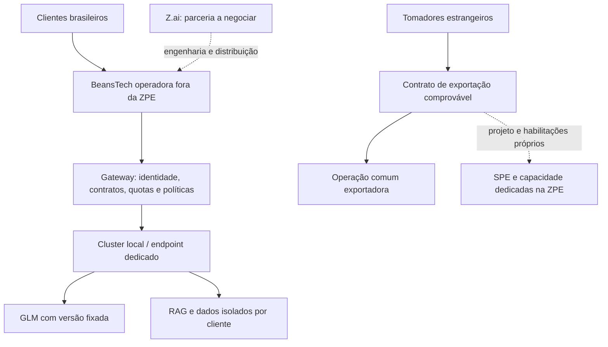

# BeansTech, Z.Cloud e GLM.Cloud — localização, exportação e parceria GLM

Data-base: 13/09/2026. Complemento ao [estudo de investimento](ESTUDO-INVESTIMENTO.md) e à [análise da ZPE](ZPE-MERCADO-BRASILEIRO-APIS-NUVEM.md). Orçamento indicado pelo empreendedor: R$ 150 milhões na V1 e R$ 300 milhões **totais** na V2. Domínios informados pelo empreendedor; titularidade e direitos de marca não auditados.

## 1. Decisão recomendada

**Iniciar a operação comercial e computacional em colocation fora da ZPE, priorizando a comparação Fortaleza versus Grande São Paulo. Manter Caucaia/CIPP, fora do perímetro aduaneiro, como candidato à construção própria. Reservar uma SPE na ZPE para demanda internacional efetivamente contratada.**

Minha preferência inicial é Fortaleza para desenvolver a operação cearense. Essa preferência depende de proposta vinculante de capacidade, refrigeração e conectividade; não é uma declaração de que exista hoje capacidade disponível no preço necessário. Se os clientes âncora estiverem no Sudeste e o teste de latência favorecer São Paulo de modo material, o primeiro cluster deve acompanhar os clientes. Não escolheria o terreno antes de medir essas variáveis.

| Alternativa | Uso recomendado | Condição para escolher |
|---|---|---|
| Colocation em Fortaleza, fora da ZPE | Piloto pago, API, processamento e primeira capacidade reservada | Energia e refrigeração para o rack real, prazo de entrega, duas rotas de telecom e custo integral contratável |
| Colocation na Grande São Paulo | Comparador obrigatório e possível primeiro cluster para clientes do Sudeste | Melhor relação entre latência medida, disponibilidade e margem dos contratos |
| Caucaia/CIPP fora da ZPE | Campus próprio após validação comercial | Terreno, energia, licenças, financiamento e demanda suficientes para superar colocation em valor presente |
| ZPE Ceará | Operação dedicada de exportação | Projeto e habilitações compatíveis, contratos internacionais, prova do resultado e segregação operacional |

O Ceará possui política estadual para datacenters na Lei 19.849/2026. Isso justifica diligenciar o estado, mas não garante benefício específico: o art. 9º trata de áreas para sistemas de armazenamento de energia; os incentivos de ICMS dependem das condições legais e regulamentares. Não atribuir terreno gratuito ou alíquota favorecida ao orçamento antes da aprovação formal.[^ce]

Para a concorrência de localização, proponho pesos internos: energia e capacidade 25%, margem e custo total 25%, latência e rede 20%, segurança e continuidade 15%, prazo 10%, incentivos confirmados 5%. São critérios de decisão propostos, não pesquisa de mercado. Incapacidade de cumprir requisito contratual elimina uma alternativa, independentemente da pontuação.

## 2. Exportadora comum e exportadora da ZPE são situações diferentes

Uma empresa brasileira **fora do regime especial da ZPE** pode ter receitas domésticas e de exportação. Exportar serviços não exige estar em ZPE. Cada contrato precisa receber tratamento tributário próprio; não há isenção geral de todos os tributos por se denominar exportadora.[^iss]

Para a pessoa jurídica exclusivamente prestadora de serviços do art. 21-C da Lei 11.508, a restrição de receita no mercado interno é requisito do regime. A permissão de venda doméstica de mercadorias industrializadas do art. 6º-C não se transfere automaticamente a APIs, SaaS e computação. Criar outra sociedade só resolve se a operação dela também for substantivamente própria; não basta refaturar serviços domésticos executados pela exportadora incentivada.[^zpe]

| Oferta | Operadora fora da ZPE | SPE exportadora na ZPE |
|---|---|---|
| API para hospital brasileiro | Caminho recomendado, tributação doméstica | Não sustentar como exportação só porque há intermediário estrangeiro |
| SaaS para empresa brasileira | Caminho recomendado | Restrição do enquadramento de serviços precisa ser respeitada |
| Processamento para tomador estrangeiro, com resultado comprovado no exterior | Pode ser exportação; examinar tributo e contrato | Candidato a projeto exportador, sujeito às aprovações do regime |
| Capacidade para plataforma global da Z.ai | Contrato internacional possível; analisar quem recebe a utilidade | Tese comercial viável para consulta formal, sem presunção de enquadramento |
| Revenda local de API estrangeira | Revisar licença, cadeia contratual, importação e venda doméstica | Não transforma cliente brasileiro em cliente estrangeiro |

API é forma de acesso. O objeto pode ser inferência, processamento, hospedagem, licença ou combinação contratual. A LC 116 lista processamento/armazenamento/hospedagem no item 1.03 e licenciamento de software no 1.05; o nome comercial não decide o enquadramento.[^iss]

## 3. Precedentes do TJSP conferidos

Foram consultados os acórdãos no repositório oficial. Não houve auditoria de andamento posterior ou certificação de trânsito em julgado. Estes julgados tratam de ISS; nenhum dos três constitui autorização de venda doméstica pela exportadora de serviços da ZPE.

### 3.1. Atos Brasil: precedente favorável à exportação de serviços de informática

**Apelação 1033695-70.2017.8.26.0053**, 18ª Câmara de Direito Público, rel. Ricardo Chimenti, **13/11/2019**. O TJSP negou o recurso municipal e manteve a exclusão de ISS sobre determinados contratos com resultado no exterior, embora houvesse atividades operacionais no Brasil por acesso remoto. Manteve parcela referente a contrato não apresentado. A prova do objeto e da utilidade foi decisiva.[^atos]

Aplicação por analogia à BeansTech: executar computação no Brasil não elimina, sozinho, a possibilidade de exportação. É necessário demonstrar quem aproveita o serviço e onde se verifica seu resultado. O acórdão não julgou inferência GLM nem concede benefício automático a qualquer nuvem.

### 3.2. Intertek: utilidade no exterior e insuficiência de documentação

**Apelação 1000685-55.2016.8.26.0090**, 18ª Câmara de Direito Público, rel. Botto Muscari, **15/08/2022**. Reconheceu a relevância da fruição no exterior para serviços realizados no Brasil. A falta de documentação para parte do período impediu conclusão integral favorável; houve provimento parcial ao recurso municipal. O caso reforça a importância de contratos, entregas e prova técnica.[^intertek]

Aplicação proposta: a medição de consumo precisa ser conciliável com contrato, destinatário e faturamento. Um contrato internacional genérico ou pagamento estrangeiro não substitui o conjunto probatório.

### 3.3. Compasso: SaaS e distribuição não escapam do ISS por serem digitais

**Apelação 1029859-50.2021.8.26.0053**, 18ª Câmara de Direito Público, rel. Ricardo Chimenti, **21/03/2024**. Recurso da Compasso Informática negado; mantida incidência do ISS no licenciamento/cessão de software, incluindo SaaS. O processo envolveu acesso a serviços de terceiros e documentação relativa à AWS. A tese de simples cessão sem serviço não prevaleceu.[^compasso]

Aplicação: vender acesso a modelos e plataformas de terceiros não assegura tratamento como mercadoria ou locação. O desenho contratual da distribuição GLM precisa refletir a prestação efetiva.

### 3.4. O que esses precedentes permitem concluir

São argumentos úteis para estruturar **exportação real de tecnologia a partir do Brasil**, inclusive fora da ZPE. Não criam uma exceção ao art. 21-C. Decisões em casos municipais paulistas tampouco equivalem a aprovação fiscal da BeansTech no Ceará. Submeter os contratos concretos a parecer jurídico e, onde cabível, consulta administrativa antes de contabilizar a desoneração.

O dossiê de exportação proposto deve conter: contrato e escopo por produto; identificação do tomador e beneficiário; descrição da utilidade no exterior; aceite de entregas; medição por organização e região; documentos fiscais e recebimentos conciliados; subcontratados; e tratamento de operações intragrupo. IP estrangeiro é indício técnico, não prova isolada. Registrar a evidência mínima necessária, evitando armazenar conteúdo sensível de clientes apenas para fins fiscais.

## 4. A oportunidade concreta com a Z.ai

**Há aderência pública à tese:** Carol Lin anunciou o **Z.ai Sovereign Partner Program — ZSP**, voltado a parceiros que implantem GLM em infraestrutura que operam e atendam clientes localmente. O anúncio descreve acesso antecipado a modelos, apoio de engenharia/FDE, atuação comercial conjunta e desenvolvimento local de negócios de tokens. A fonte inclui chamada para a primeira turma.[^zsp]

Isso constitui uma oportunidade de candidatura, não aprovação, exclusividade territorial, investimento ou compromisso de compra. O anúncio público não oferece termos econômicos suficientes para modelar receita garantida.

### Proposta de valor da BeansTech — hipóteses a demonstrar

| O que levar à negociação | Por que pode interessar à Z.ai | Prova necessária |
|---|---|---|
| Operação local de inferência GLM | Amplia distribuição com execução regional | Cluster demonstrável, equipe, capacidade e SLA medido |
| Entrada em saúde, jurídico e finanças | Oferece aplicações além de chat e programação | Pilotos pagos e resultados por tarefa |
| Português brasileiro especializado | Reduz esforço de adaptação e implantação | Benchmark separado de treino, revisado por especialistas |
| Governança de dados e suporte local | Facilita avaliação empresarial de risco | Contratos, auditoria, isolamento, resposta a incidentes |
| Comercialização em reais | Simplifica contratação dos clientes brasileiros | Operação fiscal, cobrança e suporte implantados |
| Z.Cloud e GLM.Cloud | Endereços curtos para descoberta e distribuição | Direitos de uso comercial e apresentação de marca acordados |

Essa é uma tese estratégica própria, não uma declaração de interesse já recebida da Z.ai. O ativo central é a capacidade de conquistar e atender clientes com margem; os domínios ajudam a apresentação.

## 5. Uso recomendado dos domínios

**Z.Cloud:** plataforma empresarial da BeansTech para APIs, processamento, RAG privado e capacidade reservada. Arquitetura com catálogo de modelos substituíveis, preservando continuidade e poder de negociação.

**GLM.Cloud:** produto especializado em execução de modelos GLM, com descrição transparente de quem opera e fatura. Se houver parceria, pode tornar-se canal conjunto conforme autorização contratual. Não apresentar como domínio oficial da Z.ai apenas pela semelhança do nome.

Modelo de navegação proposto: `z.cloud` comercial; `console.z.cloud` organizações, projetos, consumo e faturamento; `api.z.cloud` inferência e tarefas; `docs.z.cloud` documentação; `status.z.cloud` disponibilidade; `trust.z.cloud` controles e documentação empresarial. São endereços propostos, não serviços publicados.

O repositório oficial GLM-5.3-Flash indica licença MIT. Isso permite avaliar implantação comercial sob seus termos, mas não substitui contrato de parceria nem autorização de marca. Verificar licença do checkpoint, componentes e redistribuição em cada release.[^glm]

## 6. Portfólio e arquitetura comercial

| Produto | Entrega | Receita proposta | Critério de aprovação |
|---|---|---|---|
| API de inferência | Respostas, extração estruturada e ferramentas | Consumo com compromisso mínimo | Custo por tarefa correta, latência p95, erros e disponibilidade |
| GLM privado | Endpoint isolado e versão controlada | Capacidade reservada + operação | Isolamento, restauração, capacidade e atualização testados |
| Processamento em lote | Documentos, OCR, classificação e embeddings | Volume ou janela de processamento | Qualidade por classe, prazo e reprocessamento idempotente |
| RAG empresarial | Busca com fontes e permissões | Implantação + assinatura + consumo | Recuperação, correção das citações e ausência de vazamento entre clientes |
| Aplicações setoriais | Fluxos de saúde, jurídico e finanças | Contrato por organização e escopo | Validação específica e supervisão compatível com o uso |
| Capacidade internacional | Inferência ou processamento para cliente externo | Reserva contratada + excedente | Resultado no exterior, margem e tratamento fiscal validados |

Não encaminhar silenciosamente dados de endpoint contratado como local a APIs estrangeiras durante falha. Política de região, subprocessadores, retenção, telemetria, acesso administrativo e contingência devem ser verificáveis. Dados no Brasil, sozinhos, não equivalem a conformidade integral.

Para o GLM-5.3-Flash, dimensionar o checkpoint efetivamente escolhido: pesos, precisão, cache, contexto, concorrência e comunicação entre GPUs. Parâmetros ativos não dimensionam sozinhos a memória de um modelo MoE. Contratar benchmark do servidor completo antes de comprar GPUs; este estudo não certifica uma configuração de hardware.[^glm]

Avaliar GLM em português e inglês com casos independentes: raciocínio documental, extração com esquema, ferramentas, resistência a instruções maliciosas e respostas apoiadas por evidências. Não inferir eficácia clínica de desempenho geral. Priorizar o modelo aberto quando atender qualidade, custo e governança; preservar alternativas quando não atender.

## 7. Proposta de parceria pronta para desenvolver

Posicionamento sugerido: **“BeansTech proposes a Brazil-operated GLM platform for regulated industries, combining local inference, Portuguese evaluation, enterprise integration and auditable data governance.”**

Entregar à Z.ai um pacote com: apresentação da empresa e equipe; propriedade e disponibilidade dos ativos; demonstração; clientes e pipeline verificáveis; plano de capacidade escalonado; benchmark; arquitetura de segurança; projeção financeira com cenários; e plano de implantação nacional. Distinguir expressamente os R$ 150 milhões/R$ 300 milhões de intenção de investimento de recursos captados ou aprovados.

Termos a negociar: apoio técnico, versões e compatibilidade; licença e marca; indicação recíproca de clientes; eventual revenda de API separada de inferência própria; regiões e acesso a dados; suporte e correção de falhas; responsabilidade; saída e portabilidade; compromissos mínimos de compra, se houver. Exclusividade só merece análise se acompanhada de contrapartidas mensuráveis.

## 8. Execução e investimento

1. **Primeiros 30 dias, meta proposta:** obter propostas comparáveis de colocation Fortaleza/Grande São Paulo; desenhar contratos domésticos e exportadores; preparar candidatura ZSP; selecionar pilotos pagos.
2. **Dias 31–60:** testar modelo, hardware e rotas; medir custo por tarefa; demonstrar isolamento, faturamento e recuperação; concluir diligência dos locais candidatos.
3. **Dias 61–90:** contratar capacidade proporcional aos compromissos dos clientes; negociar termos de parceria; atualizar o modelo financeiro com preços vinculantes e margem real.
4. **Construção V1:** liberar por marcos após energia, terreno, licenciamento, demanda e financiamento. **V2 até R$ 300 milhões totais:** expansão dependente de utilização, contratos e retorno incremental.

O [modelo financeiro existente](modelo_financeiro.py) apresenta VPL negativo no cenário de referência sem benefícios aprovados. Portanto, a parceria deve melhorar receita contratada, custos ou risco de execução de maneira demonstrável. Anúncio de programa e domínio memorável não alteram, por si, essa conclusão.

BNB, incentivos e terreno permanecem sujeitos às condições do [estudo principal](ESTUDO-INVESTIMENTO.md). Não há contratação, candidatura enviada, implantação ou compromisso externo realizado por este documento.

## Fontes primárias

[^ce]: [Assembleia Legislativa do Ceará — Lei 19.849/2026](https://www2.al.ce.gov.br/legislativo/legislacao5/leis2026/19849.htm).
[^iss]: [LC 116/2003 — art. 2º e lista de serviços](https://www.planalto.gov.br/ccivil_03/leis/lcp/lcp116.htm).
[^zpe]: [Lei 11.508/2007 compilada — arts. 6º-C e 21-C](https://www.planalto.gov.br/ccivil_03/_ato2007-2010/2007/lei/l11508compilado.htm).
[^atos]: [TJSP — Atos Brasil, acórdão 13078315](https://esaj.tjsp.jus.br/cjsg/getArquivo.do?casChecked=true&cdAcordao=13078315&cdForo=0), especialmente páginas 1–2 e 8–12.
[^intertek]: [TJSP — Intertek, acórdão 15946892](https://esaj.tjsp.jus.br/cjsg/getArquivo.do?casChecked=true&cdAcordao=15946892&cdForo=0), especialmente páginas 1–2 e fundamentação.
[^compasso]: [TJSP — Compasso, acórdão 17704453](https://esaj.tjsp.jus.br/cjsg/getArquivo.do?casChecked=true&cdAcordao=17704453&cdForo=0), especialmente páginas 1–2 e 7–10.
[^zsp]: [Carol Lin — anúncio público do Z.ai Sovereign Partner Program](https://www.linkedin.com/posts/carol-lin-1a286a81_zsp-glm-sovereignai-activity-7501599916947984385-MD4Y). Fonte direta do anúncio; não substitui termos contratuais do programa.
[^glm]: [Z.ai — GLM-5.3-Flash, model card oficial](https://huggingface.co/zai-org/GLM-5.3-Flash).
