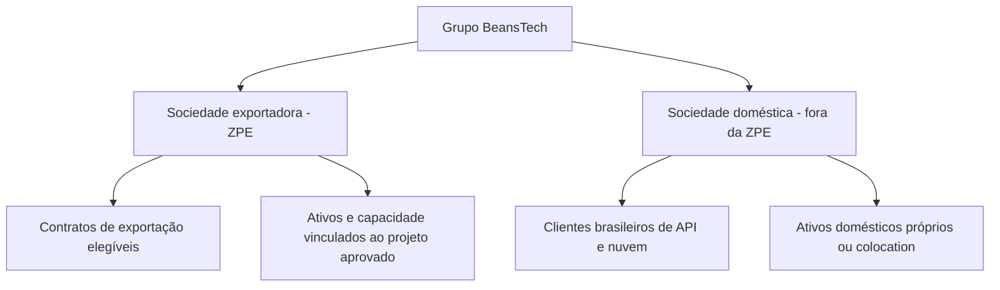

# BeansTech — venda de produtos, APIs e nuvem ao mercado brasileiro a partir de ZPE

Data-base: 13/09/2026. Adendo ao [estudo de investimento](ESTUDO-INVESTIMENTO.md).

## 1. Conclusão corrigida e delimitada

**Não existe proibição geral de vender qualquer produto de uma ZPE no Brasil.** Há tratamentos diferentes para mercadorias industrializadas, exportação de serviços, serviços vinculados à industrialização e atividades de apoio. Para APIs, SaaS, processamento e nuvem, porém, não foi identificada autorização geral para que uma nova empresa enquadrada como exportadora de serviços na ZPE também fature clientes do mercado interno mantendo esse enquadramento.

A Receita Federal, em página atualizada em 29/07/2026, exige projeto de serviços exclusivamente ao mercado externo e ausência de receita no mercado interno. A condição não é apresentada como opção de simplesmente recolher impostos sobre vendas brasileiras. [Habilitação de prestadoras de serviços — Receita Federal](https://www.gov.br/pt-br/servicos/habilitar-pj-zpe).

A interpretação anterior deve, portanto, ser lida assim: **a restrição discutida é da operação beneficiária e do seu enquadramento; não impede a BeansTech como grupo de vender APIs, dados e nuvem no Brasil por uma operação doméstica adequadamente estruturada.**

## 2. O que a legislação distingue

| Modalidade | Regra identificada | Consequência para a BeansTech |
|---|---|---|
| Mercadorias industrializadas | Art. 6º-C admite venda interna com tributos e condições | Possível para produto industrial efetivo aprovado, não por renomear SaaS |
| Exportadora de serviços | Art. 21-C exige mercado externo e veda receita interna de serviços | API e nuvem brasileiras não entram automaticamente nessa operação |
| Serviços vinculados à industrialização | Art. 21-A contempla vínculo e aprovação; § 6º veda atender empresas nacionais fora da ZPE | Não é passe livre para atender bancos/hospitais externos |
| Apoio dentro da ZPE | Art. 21-B permite instalação autorizada em hipóteses de apoio, sem benefícios do regime | Não autoriza presumir datacenter comercial geral ou uso de ativos incentivados |

A venda industrial interna também envolve tratamento administrativo/cambial e apuração dos tributos, não simples emissão de nota sem ajuste. A antiga exigência geral de 80% foi revogada; isso não elimina as condições próprias dos serviços. [Lei 11.508/2007 compilada, arts. 6º-C, 12, 18 e 21-A a 21-C](https://www.planalto.gov.br/ccivil_03/_ato2007-2010/2007/lei/l11508compilado.htm).

## 3. Software, bases de dados e nuvem estão expressamente contemplados

A Resolução CZPE/MDIC 95/2025 lista atividades elegíveis à **exportação de serviços**. Ela inclui categorias que correspondem diretamente aos produtos desejados:

| Código NBS da lista | Categoria resumida | Aplicação candidata |
|---|---|---|
| 1.1103.22.00 | Licença de software | Licenciamento de plataforma |
| 1.1103.23.00 | Licença de banco de dados | Acesso/licenciamento de acervo |
| 1.1506.21.00 | SaaS | Aplicação hospedada |
| 1.1506.22.00 | IaaS | Computação e infraestrutura |
| 1.1506.23.00 | PaaS | Plataforma gerenciada |
| 1.1506.90.00 | Outras modalidades de hospedagem/infraestrutura TI | Candidato conforme contrato |
| 1.1509.00.00 | Processamento de dados | Processamento e inferência, conforme escopo |

Esses códigos não são classificação fiscal definitiva do portfólio BeansTech. “API” é meio de entrega: o objeto pode ser consulta a base, processamento, licença ou outro serviço. A elegibilidade da categoria ao regime não afasta a destinação externa exigida pelo enquadramento.

Fonte: [Resolução 95/2025 — endereço oficial do DOU](https://www.in.gov.br/en/web/dou/-/resolucao-czpe/mdic-n-95-de-29-de-maio-de-2025-634384447), com texto consultado na [reprodução do DOU hospedada pela Assespro, páginas 1–3](https://assespropr.org.br/wp-content/uploads/2025/06/RESOLUCAO-CZPE_MDIC-No-95-DE-29-DE-MAIO-DE-2025-DOU-Imprensa-Nacional.pdf). A existência do ato e o link oficial constam do [índice do MDIC](https://www.gov.br/mdic/pt-br/assuntos/zpe/decisoes/resolucoes-czpe/copy_of_2025-resolucoes-czpe). O acesso direto ao DOU falhou nesta consulta; a reprodução não substitui a versão certificada.

## 4. Por que chamar de “produto digital” não resolve

A nomenclatura comercial não determina a natureza jurídica da operação. Um contrato de assinatura de API com consultas mensais continua exigindo análise do serviço efetivamente contratado, mesmo que a proposta use “produto”, “créditos”, “tokens” ou “pacote de dados”.

A LC 116/2003 contempla processamento/armazenamento/hospedagem no subitem 1.03 e licenciamento de software no 1.05. O STF decidiu pela incidência de ISS, em lugar de ICMS, sobre licenciamento/cessão de uso de software nas ADIs 1945 e 5659. Esses fundamentos reforçam a necessidade de examinar o objeto real, mas não são, isoladamente, decisão específica sobre um contrato BeansTech em ZPE. [LC 116](https://www.planalto.gov.br/ccivil_03/leis/lcp/lcp116.htm), [STF, conclusão do julgamento em 18/02/2021](https://portal.stf.jus.br/noticias/verNoticiaDetalhe.asp?idConteudo=460772&tip=UN).

Um appliance físico fabricado e vendido com software pode ter componentes distintos de mercadoria, licença, suporte e nuvem. Seria necessário projeto industrial real, classificação e segregação contratual. Colocar arquivos num SSD não demonstra, por si, direito de tratar a receita recorrente de IA como venda industrial.

A transição para CBS/IBS requer análise específica por data. A inclusão de bens imateriais na tributação do consumo não transforma automaticamente APIs em mercadorias industrializadas para todos os efeitos de outro regime jurídico.

## 5. Exemplos aplicados ao portfólio

As conclusões abaixo são aplicações analíticas das regras identificadas, não soluções de consulta vinculantes para os contratos.

| Operação pretendida | Avaliação preliminar |
|---|---|
| RagMed cobra de hospital brasileiro por consultas à API | Receita doméstica de serviço; incompatível com a premissa de exclusividade externa do art. 21-C |
| BeansTech cobra de banco brasileiro por GPU dedicada, backup e cloud | Mesma dificuldade; B2B e setor regulado não criam exceção territorial |
| Licença de base jurídica para escritório brasileiro | A lista NBS contempla licenciamento de bases como serviço; não presumir a regra de mercadorias |
| Exportadora na ZPE contrata e presta processamento a empresa estrangeira | Candidato a exportação, sujeito a contrato, objeto, destinatário e comprovação |
| Empresa estrangeira apenas refatura a API para cliente brasileiro previamente definido | Estrutura exige exame de substância; intermediação não comprova exportação elegível |
| Plataforma global estrangeira usa infraestrutura brasileira e possui usuários no Brasil | Não é possível decidir somente pelo IP dos usuários; examinar serviço contratado, adquirente e destinação efetiva |
| Empresa brasileira fora da ZPE fornece software ou suporte a beneficiária na ZPE | Operação de entrada, diferente da exportadora vender para fora da ZPE; estudar o tratamento da aquisição pelo beneficiário |
| Empresa do grupo fora da ZPE compra toda a inferência da empresa beneficiária e revende aqui | A venda intermediária da beneficiária à brasileira continua sendo problema; outro CNPJ não o elimina |
| Operação doméstica usa GPUs próprias fora da ZPE e vende APIs no Brasil | Alternativa estrutural coerente, com tributação e requisitos ordinários aplicáveis |

É essencial distinguir **onde estão os servidores**, **quem é o contratante**, **qual o objeto faturado**, **quem efetivamente recebe o serviço** e **qual empresa está habilitada**. Pagamento em dólar, contrato em inglês ou servidor em zona aduaneira não bastam para caracterizar exportação.

## 6. A MP 1.307/2025 e a infraestrutura para outra exportadora

O guia de projetos empresariais do MDIC descreve serviços vinculados à exportação de serviços com base na MP 1.307/2025. O próprio guia advertia que a medida ainda poderia perder eficácia. O Congresso registra encerramento da vigência em **17/11/2025**. [Guia de projetos](https://www.gov.br/mdic/pt-br/assuntos/zpe/guias/projetos-empresariais/guia.pdf), [tramitação da MP](https://www.congressonacional.leg.br/materias/medidas-provisorias/-/mpv/169682).

Há resoluções de novembro de 2025 para a cadeia CDV/ExportData/ByteDance, com enquadramentos distintos: exportação de serviços e serviços vinculados. Esses precedentes precisam ser lidos em conjunto com a data e o fundamento de cada aprovação. Não foi obtido o inteiro teor dos processos administrativos ou uma manifestação sobre como sua situação se aplica a novos projetos. [Resoluções 101 e 103–112 no índice oficial](https://www.gov.br/mdic/pt-br/assuntos/zpe/decisoes/resolucoes-czpe/copy_of_2025-resolucoes-czpe).

A perda de vigência de uma MP não permite concluir automaticamente que todos os atos anteriores foram anulados. Também não permite considerar sua ampliação uma autorização permanente para a BeansTech. A situação dos atos e das relações constituídas durante sua vigência deve ser examinada juridicamente, inclusive sob o art. 62 da Constituição.

**Resultado para a decisão:** infraestrutura fornecida a uma exportadora instalada na ZPE é uma trilha de diligência específica, apoiada em precedentes históricos, mas não uma autorização comprovada para abrir nuvem ao mercado brasileiro em geral.

## 7. Estruturas possíveis e o que não está demonstrado

### A. Operação doméstica fora do perímetro da ZPE

Recomendação para a primeira carteira brasileira: instalação própria ou colocation fora do perímetro aduaneiro, com infraestrutura e faturamento domésticos. Pode continuar no Ceará e ser candidata a outros instrumentos, sob suas condições. Não depende de artificialmente transformar o cliente brasileiro em estrangeiro.

### B. Duas operações efetivamente separadas

Uma sociedade para exportação elegível e outra para mercado doméstico. Exige ativos, contratos, receitas, autorização, dados e capacidade computacional rastreáveis. Infraestrutura doméstica não deve ser considerada beneficiada só porque pertence ao mesmo grupo.

Não basta abrir filial comercial da beneficiária: a Lei 14.184/2021 introduziu restrição à filial operacional fora da ZPE, admitindo hipóteses auxiliares. O desenho exige análise societária e operacional, não apenas troca do emissor da nota. [Lei 14.184/2021, alteração do art. 4º, § 9º](https://www.planalto.gov.br/ccivil_03/_ato2019-2022/2021/lei/l14184.htm).

### C. Atividade sem benefício dentro da ZPE

O art. 21-B é uma hipótese de apoio sujeita a autorização. Não foi confirmada sua aplicabilidade a um datacenter que atenda amplamente o Brasil. Um prédio em área maior do CIPP, mas fora do polígono da ZPE, é caso diferente. Solicitar confirmação do lote e do uso pretendido.

### D. Compartilhar a mesma GPU entre operação nacional e exportadora

Não há autorização geral identificada para importar GPU com incentivo da exportadora e dividir as horas entre mercado interno e externo por contabilidade. Kubernetes, partições de GPU e medição por tenant são controles técnicos; não criam enquadramento legal. Não incorporar essa economia ao orçamento até resposta formal sobre ativos, uso e receitas.

### E. Outro incentivo, como REDATA

REDATA e ZPE são regimes distintos. No estudo, o PL 278/2026 estava aguardando sanção na data-base; a ficha consultada nesta pesquisa permanece a referência de acompanhamento. Se vier a produzir efeitos e a empresa se habilitar, analisar a alternativa em seus próprios termos, sem presumir que revogue as restrições da ZPE. [PL 278/2026](https://www25.senado.leg.br/en_US/web/atividade/materias/-/materia/172786).

## 8. Dados por API: duas questões independentes

**A origem pública de um dado não transforma em exportação uma venda doméstica de serviço.** É possível que a BeansTech agregue valor legítimo com atualização, curadoria, indexação e resposta; o contrato ainda precisa de classificação e enquadramento territorial.

Separadamente, verificar licença e finalidade dos dados. Uma API de documentos públicos não equivale a autorização de revenda irrestrita de todo conteúdo; dados pessoais, prontuários e material de terceiros exigem análise própria. A organização das fontes está no [catálogo de APIs públicas](../RAGMED-APIS-PUBLICAS.md).

Exemplos a discriminar no contrato: acesso temporário a base; licença de uma cópia; atualização recorrente; processamento de dados do cliente; geração de resposta; armazenamento; hospedagem; licença de software. Uma cobrança única pode reunir vários objetos e exigir segregação.

## 9. Consulta concreta para resolver antes de investir

Preparar três operações completas, com diagrama, minuta de contrato, NBS candidata, fluxo financeiro e ativos envolvidos:

1. Hospital brasileiro compra RagMed por API, com inferência no campus proposto.
2. Cliente estrangeiro contrata capacidade de processamento da sociedade exportadora.
3. Sociedade doméstica e exportadora pretendem usar instalação ou equipamentos comuns.

Submeter ao CZPE/MDIC a elegibilidade e o projeto; à Receita Federal a interpretação tributária por procedimento apropriado; à administradora o perímetro e uso; às autoridades locais os tributos de sua competência. Consulta informativa e conversa comercial não substituem resposta formal com efeito jurídico aplicável.

Perguntas que precisam de resposta escrita:

- Existe base vigente que autorize receita doméstica dessa API no projeto beneficiário?
- Se houver, qual dispositivo, qual NBS, quais tributos e quais obrigações?
- A hipótese de apoio ou de serviço vinculado aplica-se ao objeto exato e a um projeto novo após a MP 1.307?
- Pode haver ativos compartilhados, com quais limites e efeitos sobre os incentivos?
- Uma sociedade sem benefício pode operar nesse lote e nesse objeto?
- Qual a consequência de receita interna incidental, cessão de capacidade e uso por empresa relacionada?

**Orientação de investimento mantida:** a BeansTech pode construir um negócio de APIs e nuvem para o Brasil. O que não está demonstrado é financiar esse negócio presumindo os benefícios de uma exportadora de serviços da ZPE sobre a mesma operação doméstica. A distinção entre produtos industriais e serviços digitais deve constar da decisão de localização e do modelo financeiro.
